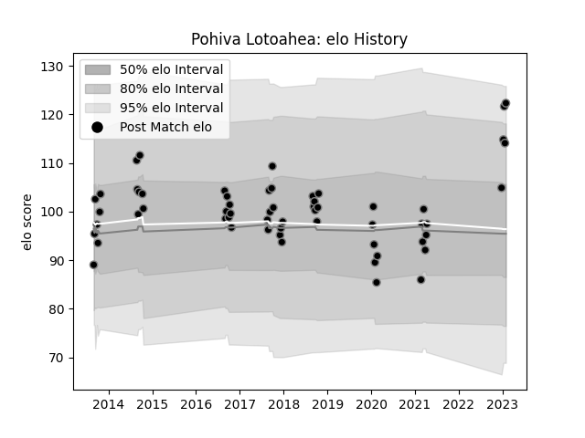

---  
layout: page  
title: Pohiva Lotoahea  
date: 2023-02-02 19:06:16.489311  
categories: player  
---
# Pohiva Lotoahea

## Positions: L

## Current elo: 122.0

## Current Percentile: 86.0

# Elo History

# Match History

| Team             |   Appearances |   Win Rate |
|:-----------------|--------------:|-----------:|
| Black Rams Tokyo |            58 |   0.439655 |

| Opponent                          |   Matches |   Win Rate |
|:----------------------------------|----------:|-----------:|
| Shizuoka Blue Revs                |         7 |   0.285714 |
| Yokohama Canon Eagles             |         6 |   0.666667 |
| Saitama Wild Knights              |         5 |   0.2      |
| Green Rockets Tokatsu             |         4 |   1        |
| Toshiba Brave Lupus Tokyo         |         4 |   0.25     |
| Coca-Cola Red Sparks              |         4 |   0.875    |
| Kobelco Kobe Steelers             |         4 |   0        |
| Kubota Spears Funabashi Tokyo-Bay |         3 |   0        |
| Tokyo Sungoliath                  |         3 |   0        |
| Hanazono Kintetsu Liners          |         3 |   0.333333 |
| Toyota Verblitz                   |         3 |   0.333333 |
| Urayasu D-Rocks                   |         3 |   0.333333 |
| NTT Docomo Red Hurricanes Osaka   |         3 |   0.666667 |
| Mie Honda Heat                    |         2 |   0.5      |
| Munakata Sanix Blues              |         2 |   1        |
| Hino Red Dolphins                 |         1 |   1        |
| Toyota Industries Shuttles Aichi  |         1 |   1        |