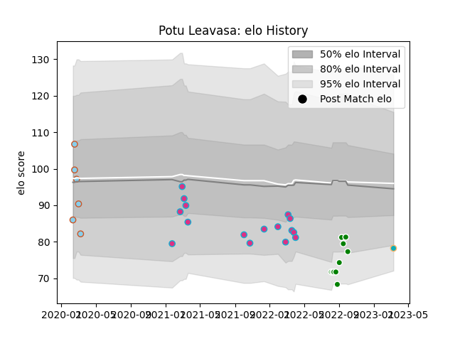

---  
layout: page  
title: Potu Leavasa  
date: 2023-03-21 18:07:50.167928  
categories: player  
---
# Potu Leavasa

Last updated: 2023-03-21
## Positions: FL, L

## Current elo: 78.0

## Current Percentile: 8.0

# Elo History

# Match History

| Team           |   Appearances |   Win Rate |
|:---------------|--------------:|-----------:|
| Zebre          |            16 |     0.0625 |
| Manawatu       |            10 |     0      |
| Austin Herd    |             6 |     0.25   |
| Moana Pasifika |             2 |     0      |

| Opponent           |   Matches |   Win Rate |
|:-------------------|----------:|-----------:|
| Ospreys            |         2 |        0   |
| Ulster             |         2 |        0   |
| Edinburgh          |         2 |        0   |
| Glasgow Warriors   |         2 |        0   |
| Auckland           |         1 |        0   |
| Waikato            |         1 |        0   |
| Utah Warriors      |         1 |        0.5 |
| Toronto Arrows     |         1 |        0   |
| Tasman             |         1 |        0   |
| Taranaki           |         1 |        0   |
| Stormers           |         1 |        0   |
| Sharks             |         1 |        0   |
| Scarlets           |         1 |        0   |
| Rugby New York     |         1 |        0   |
| R.U. New York      |         1 |        0   |
| Otago              |         1 |        0   |
| Old Glory DC       |         1 |        0   |
| Biarritz Olympique |         1 |        0   |
| Northland          |         1 |        0   |
| North Harbour      |         1 |        0   |
| Munster            |         1 |        0   |
| Leinster           |         1 |        0   |
| Houston SaberCats  |         1 |        1   |
| Hawke's Bay        |         1 |        0   |
| Dragons            |         1 |        1   |
| Counties Manukau   |         1 |        0   |
| Canterbury         |         1 |        0   |
| Bulls              |         1 |        0   |
| Brumbies           |         1 |        0   |
| Western Force      |         1 |        0   |