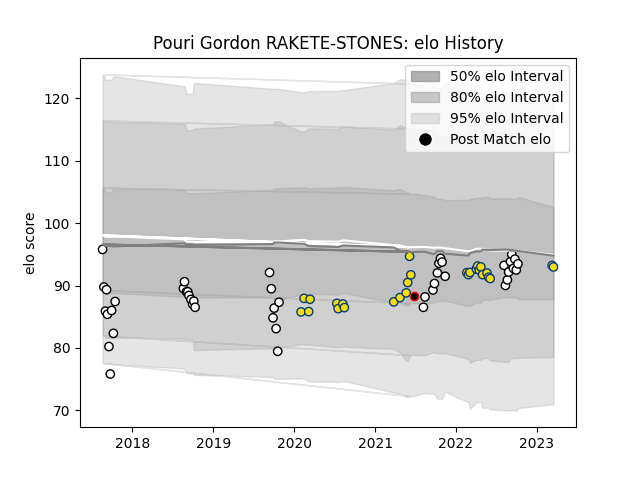

---  
layout: page  
title: Pouri Gordon RAKETE-STONES  
date: 2023-03-16 11:30:04.477822  
categories: player  
---
# Pouri Gordon RAKETE-STONES

## Positions: P

## Country: New Zealand Maori

## Current elo: 93.0

## Current Percentile: 39.0

# Elo History

# Match History

| Team              |   Appearances |   Win Rate |
|:------------------|--------------:|-----------:|
| Hawke's Bay       |            45 |       0.5  |
| Hurricanes        |            25 |       0.56 |
| New Zealand Maori |             1 |       1    |

| Opponent         |   Matches |   Win Rate |
|:-----------------|----------:|-----------:|
| Bay of Plenty    |         6 |   0.333333 |
| Highlanders      |         5 |   0.8      |
| Tasman           |         5 |   0.4      |
| Canterbury       |         4 |   0.25     |
| Chiefs           |         4 |   0.5      |
| Counties Manukau |         4 |   0.5      |
| Wellington       |         4 |   0.25     |
| Manawatu         |         4 |   1        |
| Waikato          |         4 |   0.625    |
| Otago            |         4 |   0.75     |
| Southland        |         3 |   1        |
| Brumbies         |         3 |   0        |
| North Harbour    |         3 |   0.333333 |
| Blues            |         3 |   0.666667 |
| Taranaki         |         3 |   0.333333 |
| Western Force    |         2 |   0.5      |
| Queensland Reds  |         2 |   1        |
| Melbourne Rebels |         2 |   1        |
| Crusaders        |         2 |   0        |
| Sharks           |         1 |   1        |
| Stormers         |         1 |   0        |
| Samoa            |         1 |   1        |
| Northland        |         1 |   0        |