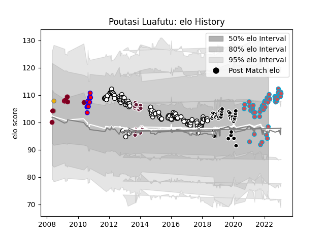

---  
layout: page  
title: Poutasi Luafutu  
date: 2023-01-17 11:43:07.563881  
categories: player  
---
# Poutasi Luafutu

## Positions: FL, N8

## Country: Australia A

## Current elo: 98.0

## Current Percentile: 76.0

# Elo History

# Match History

| Team             |   Appearances |   Win Rate |
|:-----------------|--------------:|-----------:|
| Brive            |           134 |   0.496269 |
| Bourgoin-Jallieu |            47 |   0.5      |
| Provence Rugby   |            41 |   0.487805 |
| Bordeaux Begles  |            15 |   0.4      |
| Queensland Reds  |            11 |   0.363636 |
| Tasman           |            11 |   0.363636 |
| Australia A      |             2 |   1        |

| Opponent                   |   Matches |   Win Rate |
|:---------------------------|----------:|-----------:|
| Oyonnax                    |        15 |   0.533333 |
| Racing 92                  |        10 |   0.3      |
| Toulon                     |         9 |   0.444444 |
| Lyon                       |         8 |   0.4375   |
| Castres Olympique          |         8 |   0.5      |
| Pau                        |         7 |   0.428571 |
| Montpellier Herault        |         7 |   0.571429 |
| Clermont Auvergne          |         7 |   0.142857 |
| Stade Francais Paris       |         6 |   0.333333 |
| Dax                        |         6 |   0.5      |
| Albi                       |         6 |   0.5      |
| Bordeaux Begles            |         6 |   0.416667 |
| Massy                      |         6 |   0.666667 |
| Stade Toulousain           |         6 |   0.416667 |
| Tarbes                     |         6 |   0.5      |
| La Rochelle                |         6 |   0.333333 |
| Biarritz Olympique         |         5 |   0.4      |
| Soyaux-Angouleme           |         5 |   0        |
| Colomiers                  |         5 |   0.6      |
| Aurillac                   |         5 |   0.6      |
| Beziers                    |         5 |   0.6      |
| Narbonne                   |         5 |   0.4      |
| Bayonne                    |         5 |   0.2      |
| Nevers                     |         4 |   0.5      |
| Chambery                   |         4 |   0.75     |
| Nice                       |         4 |   0.5      |
| Carcassonne                |         4 |   0.25     |
| Dijon                      |         4 |   0.75     |
| Grenoble                   |         4 |   0.5      |
| Mont-de-Marsan             |         3 |   0.666667 |
| US Bressane                |         3 |   0.333333 |
| Valence Romans Drome Rugby |         3 |   0.5      |
| Worcester Warriors         |         3 |   1        |
| Agen                       |         3 |   0.333333 |
| Bath Rugby                 |         3 |   0        |
| Dragons                    |         3 |   0.666667 |
| Brive                      |         3 |   0.333333 |
| Connacht                   |         3 |   0.333333 |
| Cognac Saint Jean d'Angély |         3 |   0.666667 |
| Newcastle Falcons          |         2 |   0.5      |
| Blagnac                    |         2 |   0.5      |
| Provence Rugby             |         2 |   1        |
| Carqueiranne-Hyères        |         2 |   1        |
| RC Enisei                  |         2 |   0.5      |
| New South Wales Waratahs   |         2 |   0        |
| Montauban                  |         2 |   1        |
| Blues                      |         2 |   0.5      |
| Auch                       |         2 |   1        |
| Vannes                     |         2 |   0.5      |
| Roval Drome XV             |         2 |   1        |
| Suresnes                   |         2 |   0.5      |
| Stormers                   |         1 |   0        |
| Sharks                     |         1 |   1        |
| Hawke's Bay                |         1 |   1        |
| Taranaki                   |         1 |   0        |
| Bay of Plenty              |         1 |   1        |
| Samoa                      |         1 |   1        |
| Auckland                   |         1 |   0        |
| Waikato                    |         1 |   0        |
| Wellington                 |         1 |   0        |
| Aubenas                    |         1 |   1        |
| Scarlets                   |         1 |   1        |
| Brumbies                   |         1 |   0        |
| Sale Sharks                |         1 |   1        |
| Cheetahs                   |         1 |   1        |
| Japan                      |         1 |   1        |
| Gloucester Rugby           |         1 |   0        |
| Manawatu                   |         1 |   0        |
| Counties Manukau           |         1 |   0        |
| Mogliano                   |         1 |   1        |
| Chiefs                     |         1 |   0        |
| Northland                  |         1 |   1        |
| Rouen                      |         1 |   1        |
| Otago                      |         1 |   0        |
| Canterbury                 |         1 |   1        |
| Bulls                      |         1 |   0        |
| Perpignan                  |         1 |   1        |
| Highlanders                |         1 |   1        |
| Rennes                     |         1 |   1        |
| Zebre                      |         1 |   0        |