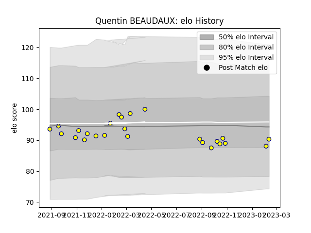

---  
layout: page  
title: Quentin BEAUDAUX  
date: 2023-02-09 13:55:12.493202  
categories: player  
---
# Quentin BEAUDAUX

## Positions: H

## Current elo: 88.0

## Current Percentile: 29.0

# Elo History

# Match History

| Team   |   Appearances |   Win Rate |
|:-------|--------------:|-----------:|
| Nevers |            24 |   0.479167 |

| Opponent         |   Matches |   Win Rate |
|:-----------------|----------:|-----------:|
| Aurillac         |         2 |        1   |
| Beziers          |         2 |        0.5 |
| Colomiers        |         2 |        0   |
| Grenoble         |         2 |        0   |
| Montauban        |         2 |        0   |
| Oyonnax          |         2 |        0   |
| Provence Rugby   |         2 |        1   |
| US Bressane      |         2 |        1   |
| Vannes           |         2 |        0.5 |
| Bayonne          |         1 |        0.5 |
| Carcassonne      |         1 |        0   |
| Mont-de-Marsan   |         1 |        0   |
| Narbonne         |         1 |        1   |
| Rouen            |         1 |        1   |
| Soyaux-Angouleme |         1 |        1   |