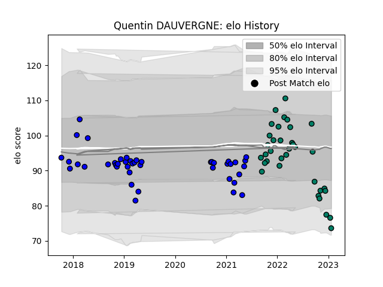

---  
layout: page  
title: Quentin DAUVERGNE  
date: 2023-02-26 11:18:19.491361  
categories: player  
---
# Quentin DAUVERGNE

## Positions: SH

## Current elo: 82.0

## Current Percentile: 9.0

# Elo History

# Match History

| Team     |   Appearances |   Win Rate |
|:---------|--------------:|-----------:|
| Massy    |            43 |   0.290698 |
| Suresnes |            36 |   0.472222 |

| Opponent                   |   Matches |   Win Rate |
|:---------------------------|----------:|-----------:|
| Blagnac                    |         5 |   0.4      |
| Tarbes                     |         5 |   0.8      |
| Albi                       |         4 |   0.5      |
| Nice                       |         4 |   0.25     |
| Aubenas                    |         4 |   0.75     |
| Dax                        |         4 |   0.25     |
| Chambery                   |         3 |   0.166667 |
| Nevers                     |         3 |   0.333333 |
| Montauban                  |         3 |   0        |
| Dijon                      |         3 |   0.666667 |
| Cognac Saint Jean d'Angély |         3 |   1        |
| Bourgoin-Jallieu           |         3 |   0.666667 |
| Biarritz Olympique         |         3 |   0.333333 |
| Beziers                    |         3 |   0        |
| US Bressane                |         3 |   0.333333 |
| Valence Romans Drome Rugby |         3 |   0        |
| Carqueiranne-Hyères        |         2 |   0.5      |
| Provence Rugby             |         2 |   0.5      |
| Carcassonne                |         2 |   0.5      |
| Soyaux-Angouleme           |         2 |   0        |
| Narbonne                   |         2 |   0        |
| Oyonnax                    |         2 |   0        |
| Rennes                     |         2 |   1        |
| Suresnes                   |         1 |   1        |
| Massy                      |         1 |   0        |
| Perpignan                  |         1 |   0        |
| Mont-de-Marsan             |         1 |   0        |
| Colomiers                  |         1 |   0        |
| Brive                      |         1 |   0        |
| Bayonne                    |         1 |   0        |
| Aurillac                   |         1 |   0        |
| Vannes                     |         1 |   0        |