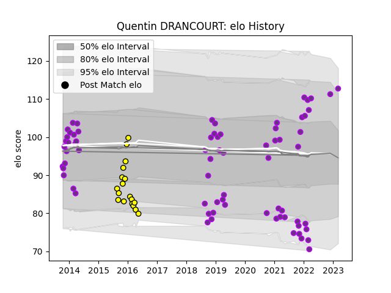

---  
layout: page  
title: Quentin DRANCOURT  
date: 2023-03-12 11:32:27.682766  
categories: player  
---
# Quentin DRANCOURT

## Positions: P

## Current elo: 112.0

## Current Percentile: 88.0

# Elo History

# Match History

| Team        |   Appearances |   Win Rate |
|:------------|--------------:|-----------:|
| US Bressane |            72 |   0.402778 |
| Carcassonne |            18 |   0.444444 |

| Opponent           |   Matches |   Win Rate |
|:-------------------|----------:|-----------:|
| Albi               |         6 |   0.166667 |
| Narbonne           |         6 |   0.333333 |
| Beziers            |         6 |   0.5      |
| Mont-de-Marsan     |         5 |   0.3      |
| Colomiers          |         5 |   0.2      |
| Aurillac           |         5 |   0.6      |
| Montauban          |         5 |   0.5      |
| Provence Rugby     |         5 |   0.3      |
| Carcassonne        |         4 |   0.25     |
| Oyonnax            |         4 |   0.25     |
| Bayonne            |         3 |   0        |
| Vannes             |         3 |   0.166667 |
| Nice               |         2 |   0        |
| Lyon               |         2 |   0        |
| Suresnes           |         2 |   1        |
| Tarbes             |         2 |   0.5      |
| Massy              |         2 |   0.5      |
| Agen               |         2 |   0.5      |
| Dijon              |         2 |   1        |
| Dax                |         2 |   0.5      |
| Chambery           |         2 |   1        |
| Brive              |         2 |   0.5      |
| Bourgoin-Jallieu   |         2 |   1        |
| Auch               |         2 |   0.5      |
| La Rochelle        |         2 |   0        |
| Nevers             |         1 |   0        |
| Blagnac            |         1 |   1        |
| Perpignan          |         1 |   0        |
| Biarritz Olympique |         1 |   1        |
| Rouen              |         1 |   1        |
| Soyaux-Angouleme   |         1 |   1        |
| Aubenas            |         1 |   1        |