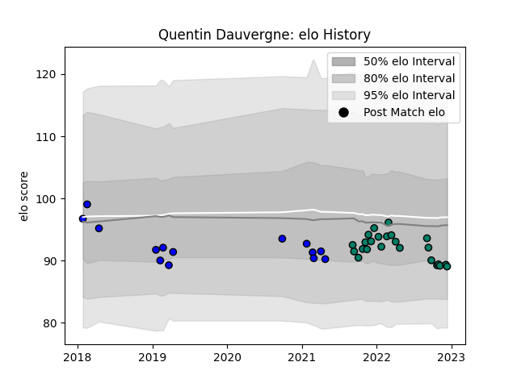

---  
layout: page  
title: Quentin Dauvergne  
date: 2022-12-18 16:24:15.183744  
categories: player  
---
# Quentin Dauvergne

## Positions: SH

## Current elo: 89.0

## Current Percentile: 21.0

# Elo History

# Match History

| Team     |   Appearances |   Win Rate |
|:---------|--------------:|-----------:|
| Suresnes |            24 |   0.625    |
| Massy    |            14 |   0.321429 |

| Opponent                   |   Matches |   Win Rate |
|:---------------------------|----------:|-----------:|
| Tarbes                     |         3 |   1        |
| Blagnac                    |         3 |   0.666667 |
| Cognac Saint Jean d'Angély |         3 |   1        |
| Albi                       |         2 |   0.5      |
| Chambery                   |         2 |   0.25     |
| Soyaux-Angouleme           |         2 |   0        |
| Nice                       |         2 |   0.5      |
| Aubenas                    |         2 |   1        |
| Dax                        |         2 |   0.5      |
| Bourgoin-Jallieu           |         2 |   1        |
| Valence Romans Drome Rugby |         2 |   0        |
| Carqueiranne-Hyères        |         1 |   1        |
| Brive                      |         1 |   0        |
| Colomiers                  |         1 |   0        |
| Dijon                      |         1 |   1        |
| Massy                      |         1 |   0        |
| Mont-de-Marsan             |         1 |   0        |
| Biarritz Olympique         |         1 |   0        |
| Oyonnax                    |         1 |   0        |
| Rennes                     |         1 |   1        |
| Beziers                    |         1 |   0        |
| Suresnes                   |         1 |   1        |
| Aurillac                   |         1 |   0        |
| US Bressane                |         1 |   0        |