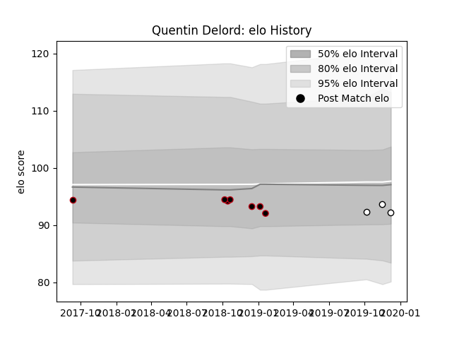

---  
layout: page  
title: Quentin Delord  
date: 2022-12-12 15:22:30.162360  
categories: player  
---
# Quentin Delord

## Positions: SH

## Current elo: 92.0

## Current Percentile: None

# Elo History

# Match History

| Team   |   Appearances |   Win Rate |
|:-------|--------------:|-----------:|
| Lyon   |             7 |   0.285714 |
| Brive  |             3 |   0.666667 |

| Opponent             |   Matches |   Win Rate |
|:---------------------|----------:|-----------:|
| Cardiff Blues        |         2 |          0 |
| Glasgow Warriors     |         1 |          0 |
| Montpellier Herault  |         1 |          1 |
| Pau                  |         1 |          0 |
| Racing 92            |         1 |          1 |
| Saracens             |         1 |          0 |
| Stade Francais Paris |         1 |          1 |
| Stade Toulousain     |         1 |          1 |
| Zebre                |         1 |          0 |