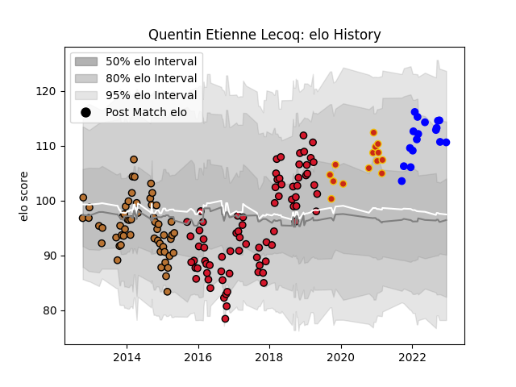

---  
layout: page  
title: Quentin Etienne Lecoq  
date: 2022-12-18 16:22:52.780371  
categories: player  
---
# Quentin Etienne Lecoq

## Positions: FB, FH

## Current elo: 111.0

## Current Percentile: 85.0

# Elo History

# Match History

| Team      |   Appearances |   Win Rate |
|:----------|--------------:|-----------:|
| Oyonnax   |            77 |   0.448052 |
| Narbonne  |            56 |   0.473214 |
| Vannes    |            17 |   0.647059 |
| Perpignan |            14 |   0.714286 |

| Opponent                   |   Matches |   Win Rate |
|:---------------------------|----------:|-----------:|
| Colomiers                  |        11 |   0.454545 |
| Mont-de-Marsan             |         9 |   0.444444 |
| Montauban                  |         8 |   0.6875   |
| Beziers                    |         8 |   0.4375   |
| Carcassonne                |         7 |   0.571429 |
| Agen                       |         7 |   0.571429 |
| Aurillac                   |         7 |   0.428571 |
| Pau                        |         6 |   0.166667 |
| Massy                      |         6 |   0.666667 |
| Stade Toulousain           |         5 |   0.3      |
| Soyaux-Angouleme           |         5 |   1        |
| Dax                        |         5 |   0.8      |
| Albi                       |         5 |   0.6      |
| Biarritz Olympique         |         4 |   0.25     |
| Lyon                       |         4 |   0.5      |
| US Bressane                |         4 |   0.75     |
| Tarbes                     |         4 |   0.375    |
| Nevers                     |         4 |   0.75     |
| Bourgoin-Jallieu           |         4 |   0.625    |
| Brive                      |         4 |   0.25     |
| La Rochelle                |         3 |   0.666667 |
| Provence Rugby             |         3 |   1        |
| Toulon                     |         3 |   0.333333 |
| Stade Francais Paris       |         3 |   0.666667 |
| Castres Olympique          |         3 |   0        |
| Racing 92                  |         3 |   0        |
| Vannes                     |         3 |   0.666667 |
| Perpignan                  |         3 |   0.333333 |
| Clermont Auvergne          |         3 |   0.5      |
| Oyonnax                    |         3 |   0.333333 |
| Grenoble                   |         3 |   0.666667 |
| Auch                       |         2 |   0.5      |
| Bordeaux Begles            |         2 |   0.5      |
| Bayonne                    |         2 |   0.5      |
| Montpellier Herault        |         2 |   0        |
| Rouen                      |         2 |   0        |
| Saracens                   |         1 |   0        |
| Narbonne                   |         1 |   1        |
| Ulster                     |         1 |   0        |
| Valence Romans Drome Rugby |         1 |   1        |