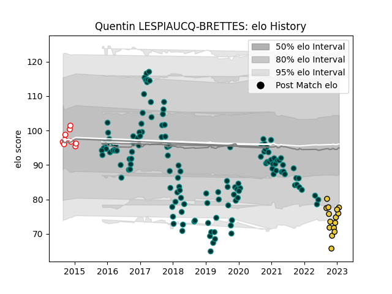

---  
layout: page  
title: Quentin LESPIAUCQ-BRETTES  
date: 2023-01-27 19:01:07.822607  
categories: player  
---
# Quentin LESPIAUCQ-BRETTES

## Positions: H

## Current elo: 78.0

## Current Percentile: 2.0

# Elo History

# Match History

| Team        |   Appearances |   Win Rate |
|:------------|--------------:|-----------:|
| Pau         |           135 |   0.437037 |
| La Rochelle |            15 |   0.733333 |
| Dax         |             9 |   0.222222 |

| Opponent             |   Matches |   Win Rate |
|:---------------------|----------:|-----------:|
| Toulon               |        14 |   0.25     |
| Stade Francais Paris |        13 |   0.461538 |
| Castres Olympique    |        12 |   0.416667 |
| Racing 92            |        10 |   0.35     |
| Brive                |         9 |   0.555556 |
| La Rochelle          |         9 |   0.222222 |
| Bordeaux Begles      |         9 |   0.444444 |
| Agen                 |         8 |   0.875    |
| Lyon                 |         8 |   0.5625   |
| Stade Toulousain     |         8 |   0.25     |
| Montpellier Herault  |         7 |   0.428571 |
| Clermont Auvergne    |         7 |   0.285714 |
| Bayonne              |         6 |   0.75     |
| Cardiff Blues        |         4 |   0.25     |
| Grenoble             |         4 |   1        |
| Oyonnax              |         4 |   0.75     |
| Perpignan            |         4 |   1        |
| Pau                  |         3 |   0        |
| Northampton Saints   |         2 |   1        |
| Ulster               |         2 |   1        |
| Bristol Rugby        |         2 |   0        |
| Bath Rugby           |         2 |   0        |
| Montauban            |         1 |   0        |
| Massy                |         1 |   0        |
| Narbonne             |         1 |   1        |
| Albi                 |         1 |   0        |
| Leicester Tigers     |         1 |   1        |
| Dragons              |         1 |   0        |
| Calvisano            |         1 |   1        |
| Sale Sharks          |         1 |   0        |
| Bourgoin-Jallieu     |         1 |   0        |
| Biarritz Olympique   |         1 |   1        |
| Tarbes               |         1 |   0        |
| London Irish         |         1 |   0        |