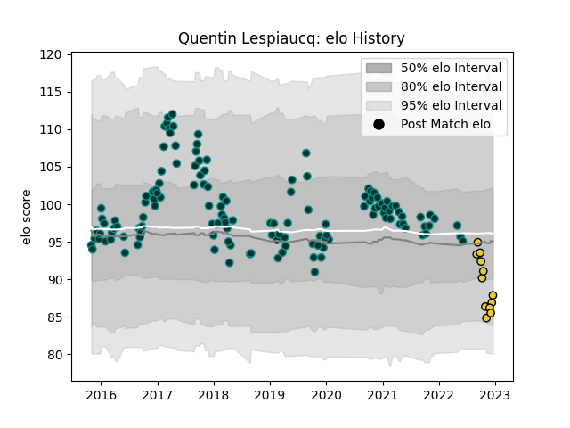

---  
layout: page  
title: Quentin Lespiaucq  
date: 2022-12-18 16:22:19.464999  
categories: player  
---
# Quentin Lespiaucq

## Positions: H

## Current elo: 88.0

## Current Percentile: 11.0

# Elo History

# Match History

| Team        |   Appearances |   Win Rate |
|:------------|--------------:|-----------:|
| Pau         |           133 |   0.443609 |
| La Rochelle |            12 |   0.666667 |

| Opponent             |   Matches |   Win Rate |
|:---------------------|----------:|-----------:|
| Toulon               |        14 |   0.25     |
| Stade Francais Paris |        13 |   0.461538 |
| Castres Olympique    |        12 |   0.416667 |
| Racing 92            |        10 |   0.35     |
| La Rochelle          |         9 |   0.222222 |
| Bordeaux Begles      |         9 |   0.444444 |
| Brive                |         9 |   0.555556 |
| Lyon                 |         8 |   0.5625   |
| Agen                 |         8 |   0.875    |
| Montpellier Herault  |         7 |   0.428571 |
| Stade Toulousain     |         7 |   0.285714 |
| Clermont Auvergne    |         7 |   0.285714 |
| Bayonne              |         6 |   0.75     |
| Cardiff Blues        |         4 |   0.25     |
| Oyonnax              |         4 |   0.75     |
| Grenoble             |         4 |   1        |
| Bath Rugby           |         2 |   0        |
| Perpignan            |         2 |   1        |
| Bristol Rugby        |         2 |   0        |
| Calvisano            |         1 |   1        |
| Leicester Tigers     |         1 |   1        |
| Northampton Saints   |         1 |   1        |
| Pau                  |         1 |   0        |
| Sale Sharks          |         1 |   0        |
| Biarritz Olympique   |         1 |   1        |
| Dragons              |         1 |   0        |
| Ulster               |         1 |   1        |