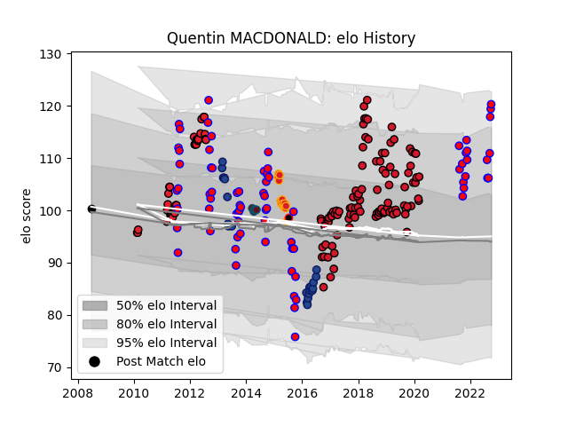

---  
layout: page  
title: Quentin MACDONALD  
date: 2023-03-12 11:29:39.484724  
categories: player  
---
# Quentin MACDONALD

## Positions: H

## Country: New Zealand Maori

## Current elo: 120.0

## Current Percentile: 92.0

# Elo History

# Match History

| Team              |   Appearances |   Win Rate |
|:------------------|--------------:|-----------:|
| Oyonnax           |           100 |   0.525    |
| Tasman            |            75 |   0.553333 |
| Crusaders         |            35 |   0.714286 |
| Blues             |            22 |   0.477273 |
| Chiefs            |            15 |   0.6      |
| Munster           |             5 |   0.4      |
| New Zealand       |             1 |   1        |
| New Zealand Maori |             1 |   1        |

| Opponent                 |   Matches |   Win Rate |
|:-------------------------|----------:|-----------:|
| Highlanders              |         9 |   0.444444 |
| Canterbury               |         8 |   0.375    |
| Waikato                  |         8 |   0.375    |
| Hurricanes               |         8 |   0.375    |
| Taranaki                 |         7 |   0.428571 |
| Hawke's Bay              |         7 |   0.714286 |
| Chiefs                   |         7 |   0.428571 |
| Otago                    |         7 |   0.428571 |
| Southland                |         6 |   1        |
| Crusaders                |         6 |   0.5      |
| Beziers                  |         6 |   0.5      |
| Auckland                 |         6 |   0.416667 |
| Counties Manukau         |         5 |   0.4      |
| Colomiers                |         5 |   0.4      |
| North Harbour            |         5 |   0.2      |
| Mont-de-Marsan           |         5 |   0.6      |
| Northland                |         5 |   0.6      |
| Bulls                    |         5 |   0.6      |
| Carcassonne              |         5 |   0.6      |
| Queensland Reds          |         5 |   0.3      |
| Sharks                   |         5 |   0.8      |
| Biarritz Olympique       |         5 |   0.4      |
| Stormers                 |         5 |   1        |
| Vannes                   |         5 |   0.4      |
| Provence Rugby           |         4 |   0.75     |
| Montauban                |         4 |   0.625    |
| Soyaux-Angouleme         |         4 |   1        |
| Manawatu                 |         4 |   0.75     |
| Agen                     |         4 |   0.75     |
| Western Force            |         4 |   1        |
| Aurillac                 |         4 |   0.75     |
| Bay of Plenty            |         4 |   1        |
| Blues                    |         4 |   1        |
| Brive                    |         4 |   0.25     |
| Grenoble                 |         3 |   0.333333 |
| Nevers                   |         3 |   0.666667 |
| Wellington               |         3 |   1        |
| Bayonne                  |         3 |   0.333333 |
| Brumbies                 |         3 |   1        |
| Cheetahs                 |         3 |   0.666667 |
| Perpignan                |         3 |   0.666667 |
| Melbourne Rebels         |         3 |   0.666667 |
| Connacht                 |         2 |   0.5      |
| Racing 92                |         2 |   0        |
| La Rochelle              |         2 |   0.25     |
| US Bressane              |         2 |   0.5      |
| Toulon                   |         2 |   0.5      |
| Albi                     |         2 |   1        |
| Stade Francais Paris     |         2 |   0.5      |
| Lyon                     |         2 |   0.5      |
| Montpellier Herault      |         2 |   0        |
| Lions                    |         2 |   0.5      |
| Dax                      |         2 |   0.5      |
| Glasgow Warriors         |         2 |   0        |
| Pau                      |         2 |   0        |
| Castres Olympique        |         2 |   0        |
| Massy                    |         2 |   1        |
| Clermont Auvergne        |         2 |   0.75     |
| New South Wales Waratahs |         2 |   0.5      |
| England                  |         1 |   1        |
| Fiji                     |         1 |   1        |
| Jaguares                 |         1 |   1        |
| Narbonne                 |         1 |   0        |
| Ulster                   |         1 |   0        |
| Benetton Treviso         |         1 |   1        |
| Stade Toulousain         |         1 |   0        |
| Bordeaux Begles          |         1 |   1        |
| Bourgoin-Jallieu         |         1 |   1        |
| Rouen                    |         1 |   1        |
| Roval Drome XV           |         1 |   1        |