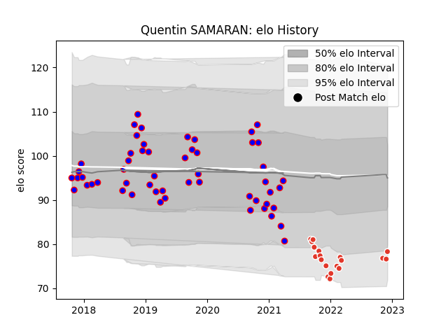

---  
layout: page  
title: Quentin SAMARAN  
date: 2023-02-16 11:19:20.414794  
categories: player  
---
# Quentin SAMARAN

## Positions: P

## Current elo: 70.0

## Current Percentile: 11.0

# Elo History

# Match History

| Team               |   Appearances |   Win Rate |
|:-------------------|--------------:|-----------:|
| Beziers            |            54 |   0.518519 |
| Biarritz Olympique |            27 |   0.425926 |

| Opponent                   |   Matches |   Win Rate |
|:---------------------------|----------:|-----------:|
| Soyaux-Angouleme           |         7 |   0.428571 |
| Montauban                  |         5 |   0.8      |
| Aurillac                   |         5 |   0.8      |
| Oyonnax                    |         5 |   0.4      |
| Grenoble                   |         5 |   0.5      |
| Provence Rugby             |         4 |   0.5      |
| Vannes                     |         4 |   0.75     |
| Colomiers                  |         4 |   0.25     |
| Biarritz Olympique         |         4 |   0.5      |
| Brive                      |         3 |   0.666667 |
| Nevers                     |         3 |   0.5      |
| Mont-de-Marsan             |         3 |   0.333333 |
| Massy                      |         3 |   1        |
| La Rochelle                |         2 |   0.5      |
| Rouen                      |         2 |   0        |
| Dax                        |         2 |   1        |
| Toulon                     |         2 |   0        |
| Bayonne                    |         2 |   0.5      |
| Perpignan                  |         2 |   0        |
| Bordeaux Begles            |         2 |   0.5      |
| Stade Toulousain           |         1 |   0        |
| Stade Francais Paris       |         1 |   0        |
| Valence Romans Drome Rugby |         1 |   0.5      |
| Agen                       |         1 |   0        |
| Racing 92                  |         1 |   1        |
| Pau                        |         1 |   0        |
| Montpellier Herault        |         1 |   0        |
| Lyon                       |         1 |   0        |
| Clermont Auvergne          |         1 |   0        |
| Carcassonne                |         1 |   1        |
| Beziers                    |         1 |   0        |
| Zebre                      |         1 |   1        |