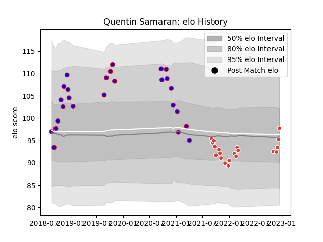

---  
layout: page  
title: Quentin Samaran  
date: 2022-12-18 16:36:52.369699  
categories: player  
---
# Quentin Samaran

## Positions: P

## Current elo: 98.0

## Current Percentile: 47.0

# Elo History

# Match History

| Team               |   Appearances |   Win Rate |
|:-------------------|--------------:|-----------:|
| Beziers            |            26 |   0.442308 |
| Biarritz Olympique |            20 |   0.375    |

| Opponent                   |   Matches |   Win Rate |
|:---------------------------|----------:|-----------:|
| Aurillac                   |         4 |   0.75     |
| Oyonnax                    |         4 |   0.5      |
| Biarritz Olympique         |         3 |   0.333333 |
| Provence Rugby             |         3 |   0.333333 |
| Bordeaux Begles            |         2 |   0.5      |
| Brive                      |         2 |   0.5      |
| Perpignan                  |         2 |   0        |
| La Rochelle                |         2 |   0.5      |
| Soyaux-Angouleme           |         2 |   0.5      |
| Rouen                      |         2 |   0        |
| Montauban                  |         2 |   1        |
| Nevers                     |         2 |   0.5      |
| Toulon                     |         2 |   0        |
| Grenoble                   |         2 |   0.75     |
| Stade Toulousain           |         1 |   0        |
| Stade Francais Paris       |         1 |   0        |
| Racing 92                  |         1 |   1        |
| Montpellier Herault        |         1 |   0        |
| Pau                        |         1 |   0        |
| Bayonne                    |         1 |   1        |
| Massy                      |         1 |   1        |
| Lyon                       |         1 |   0        |
| Colomiers                  |         1 |   0        |
| Clermont Auvergne          |         1 |   0        |
| Beziers                    |         1 |   0        |
| Valence Romans Drome Rugby |         1 |   0.5      |