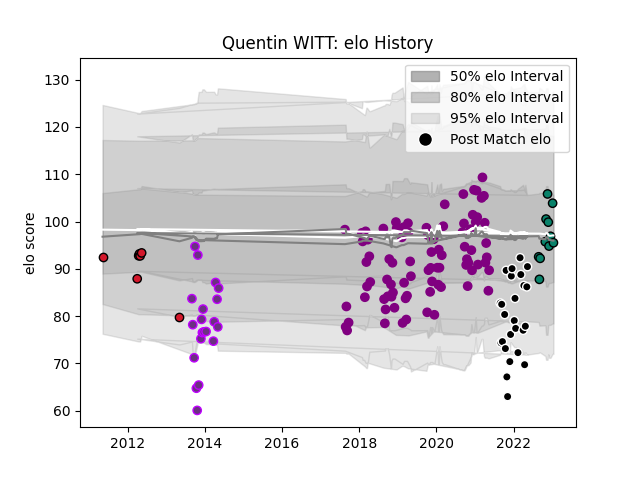

---  
layout: page  
title: Quentin WITT  
date: 2023-03-30 11:31:15.544378  
categories: player  
---
# Quentin WITT

Last updated: 2023-03-30
## Positions: FL, N8

## Current elo: 89.0

## Current Percentile: 13.0

# Elo History

# Match History

| Team             |   Appearances |   Win Rate |
|:-----------------|--------------:|-----------:|
| Soyaux-Angouleme |            84 |   0.458333 |
| Provence Rugby   |            25 |   0.66     |
| US Bressane      |            20 |   0.275    |
| Montauban        |            18 |   0.472222 |
| Oyonnax          |             7 |   0.428571 |

| Opponent                   |   Matches |   Win Rate |
|:---------------------------|----------:|-----------:|
| Colomiers                  |        11 |   0.545455 |
| Mont-de-Marsan             |        10 |   0.45     |
| Beziers                    |        10 |   0.6      |
| Aurillac                   |         9 |   0.666667 |
| Carcassonne                |         9 |   0.333333 |
| Provence Rugby             |         8 |   0.75     |
| Biarritz Olympique         |         8 |   0.375    |
| Nevers                     |         8 |   0.5625   |
| Montauban                  |         8 |   0.5      |
| Grenoble                   |         8 |   0.5      |
| Vannes                     |         7 |   0.5      |
| Oyonnax                    |         7 |   0.142857 |
| Agen                       |         6 |   0.5      |
| Bayonne                    |         5 |   0.6      |
| Rouen                      |         5 |   0.2      |
| Massy                      |         5 |   0.5      |
| Dax                        |         4 |   0.5      |
| Perpignan                  |         4 |   0        |
| US Bressane                |         4 |   0.625    |
| Narbonne                   |         3 |   0.333333 |
| Pau                        |         3 |   0        |
| Bourgoin-Jallieu           |         2 |   0.5      |
| Roval Drome XV             |         2 |   0.5      |
| Soyaux-Angouleme           |         2 |   0.5      |
| Valence Romans Drome Rugby |         2 |   0.75     |
| Lyon                       |         1 |   0        |
| Albi                       |         1 |   0        |
| La Rochelle                |         1 |   0        |
| Auch                       |         1 |   1        |