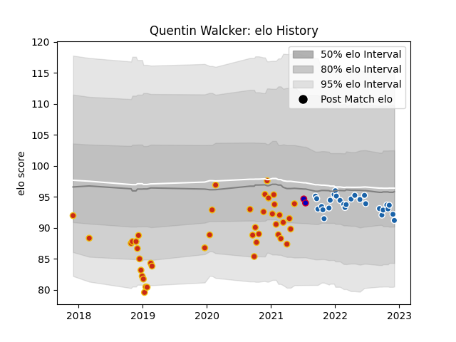

---  
layout: page  
title: Quentin Walcker  
date: 2022-12-18 16:27:32.224605  
categories: player  
---
# Quentin Walcker

## Positions: P

## Country: France

## Current elo: 92.0

## Current Percentile: 28.0

# Elo History

# Match History

| Team              |   Appearances |   Win Rate |
|:------------------|--------------:|-----------:|
| Perpignan         |            42 |   0.583333 |
| Castres Olympique |            29 |   0.603448 |
| France            |             2 |   0        |

| Opponent                   |   Matches |   Win Rate |
|:---------------------------|----------:|-----------:|
| Stade Francais Paris       |         4 |   0.5      |
| Clermont Auvergne          |         4 |   0.75     |
| Montpellier Herault        |         4 |   0.5      |
| Biarritz Olympique         |         4 |   0.5      |
| Bordeaux Begles            |         4 |   0.125    |
| Stade Toulousain           |         4 |   0.5      |
| Perpignan                  |         3 |   0.666667 |
| Racing 92                  |         3 |   0.333333 |
| Aurillac                   |         3 |   0.833333 |
| Montauban                  |         3 |   0.666667 |
| Carcassonne                |         3 |   1        |
| Provence Rugby             |         2 |   1        |
| Toulon                     |         2 |   0        |
| Pau                        |         2 |   0.5      |
| Nevers                     |         2 |   0.5      |
| Valence Romans Drome Rugby |         2 |   1        |
| Mont-de-Marsan             |         2 |   1        |
| Vannes                     |         2 |   1        |
| Lyon                       |         2 |   0.5      |
| La Rochelle                |         2 |   0.5      |
| Connacht                   |         2 |   0        |
| Brive                      |         2 |   1        |
| Australia                  |         2 |   0        |
| Oyonnax                    |         1 |   1        |
| Grenoble                   |         1 |   1        |
| Edinburgh                  |         1 |   0        |
| Colomiers                  |         1 |   1        |
| Rouen                      |         1 |   1        |
| Sale Sharks                |         1 |   0        |
| Soyaux-Angouleme           |         1 |   1        |
| Castres Olympique          |         1 |   0        |
| Beziers                    |         1 |   1        |
| Agen                       |         1 |   0        |