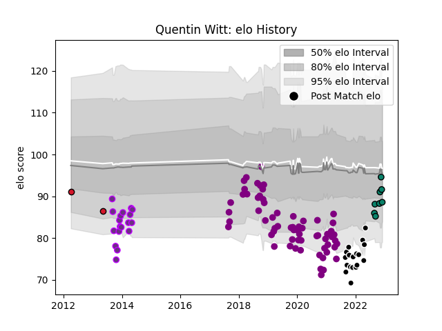

---  
layout: page  
title: Quentin Witt  
date: 2022-12-18 16:24:25.684260  
categories: player  
---
# Quentin Witt

## Positions: FL, N8

## Current elo: 90.0

## Current Percentile: 21.0

# Elo History

# Match History

| Team             |   Appearances |   Win Rate |
|:-----------------|--------------:|-----------:|
| Soyaux-Angouleme |            64 |   0.445312 |
| Provence Rugby   |            18 |   0.694444 |
| US Bressane      |            18 |   0.25     |
| Montauban        |             9 |   0.611111 |
| Oyonnax          |             2 |   0        |

| Opponent                   |   Matches |   Win Rate |
|:---------------------------|----------:|-----------:|
| Montauban                  |         8 |   0.5      |
| Beziers                    |         8 |   0.75     |
| Carcassonne                |         8 |   0.375    |
| Colomiers                  |         8 |   0.5      |
| Mont-de-Marsan             |         7 |   0.5      |
| Aurillac                   |         7 |   0.571429 |
| Biarritz Olympique         |         6 |   0.333333 |
| Grenoble                   |         6 |   0.5      |
| Rouen                      |         5 |   0.2      |
| Provence Rugby             |         5 |   0.6      |
| Oyonnax                    |         5 |   0.2      |
| Nevers                     |         5 |   0.5      |
| Agen                       |         4 |   0.5      |
| Vannes                     |         4 |   0.625    |
| Massy                      |         3 |   0.666667 |
| US Bressane                |         3 |   0.5      |
| Narbonne                   |         2 |   0        |
| Dax                        |         2 |   0        |
| Bourgoin-Jallieu           |         2 |   0.5      |
| Pau                        |         2 |   0        |
| Perpignan                  |         2 |   0        |
| Bayonne                    |         2 |   0.5      |
| Roval Drome XV             |         2 |   0.5      |
| Albi                       |         1 |   0        |
| Lyon                       |         1 |   0        |
| Auch                       |         1 |   1        |
| Soyaux-Angouleme           |         1 |   1        |
| Valence Romans Drome Rugby |         1 |   1        |