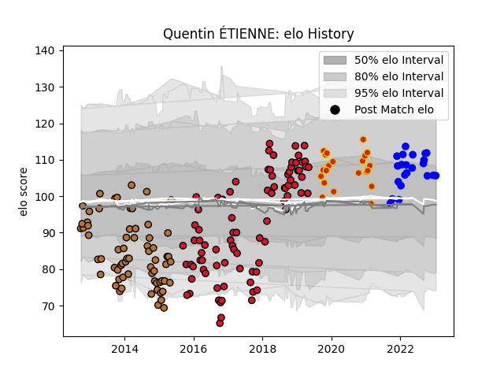

---  
layout: page  
title: Quentin ÉTIENNE  
date: 2023-01-19 11:51:12.467735  
categories: player  
---
# Quentin ÉTIENNE

## Positions: FB, FH

## Current elo: 106.0

## Current Percentile: 69.0

# Elo History

# Match History

| Team      |   Appearances |   Win Rate |
|:----------|--------------:|-----------:|
| Oyonnax   |            85 |   0.476471 |
| Narbonne  |            66 |   0.507576 |
| Perpignan |            22 |   0.681818 |
| Vannes    |            22 |   0.613636 |

| Opponent                   |   Matches |   Win Rate |
|:---------------------------|----------:|-----------:|
| Aurillac                   |        12 |   0.666667 |
| Colomiers                  |        12 |   0.5      |
| Carcassonne                |        11 |   0.727273 |
| Mont-de-Marsan             |        11 |   0.454545 |
| Beziers                    |        10 |   0.45     |
| Agen                       |         9 |   0.555556 |
| Montauban                  |         9 |   0.611111 |
| Pau                        |         7 |   0.142857 |
| Dax                        |         7 |   0.714286 |
| Massy                      |         6 |   0.666667 |
| Soyaux-Angouleme           |         6 |   1        |
| Albi                       |         6 |   0.666667 |
| Nevers                     |         5 |   0.6      |
| US Bressane                |         5 |   0.8      |
| Tarbes                     |         5 |   0.3      |
| Stade Toulousain           |         5 |   0.3      |
| Vannes                     |         5 |   0.6      |
| Biarritz Olympique         |         5 |   0.4      |
| Lyon                       |         4 |   0.5      |
| Brive                      |         4 |   0.25     |
| Bourgoin-Jallieu           |         4 |   0.625    |
| Oyonnax                    |         4 |   0.25     |
| La Rochelle                |         3 |   0.666667 |
| Toulon                     |         3 |   0.333333 |
| Castres Olympique          |         3 |   0        |
| Stade Francais Paris       |         3 |   0.666667 |
| Clermont Auvergne          |         3 |   0.5      |
| Racing 92                  |         3 |   0        |
| Provence Rugby             |         3 |   1        |
| Perpignan                  |         3 |   0.333333 |
| Grenoble                   |         3 |   0.666667 |
| Auch                       |         3 |   0.666667 |
| Rouen                      |         2 |   0        |
| Bayonne                    |         2 |   0.5      |
| Narbonne                   |         2 |   0.75     |
| Montpellier Herault        |         2 |   0        |
| Bordeaux Begles            |         2 |   0.5      |
| Saracens                   |         1 |   0        |
| Ulster                     |         1 |   0        |
| Valence Romans Drome Rugby |         1 |   1        |