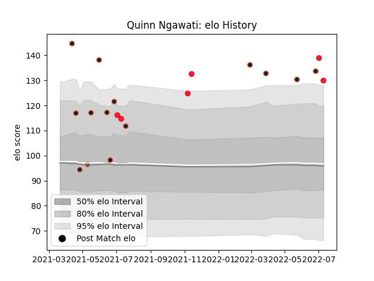

---  
layout: page  
title: Quinn Ngawati  
date: 2023-03-17 17:22:19.719108  
categories: player  
---
# Quinn Ngawati

## Positions: C, W

## Country: Canada

## Current elo: 130.0

## Current Percentile: 98.0

# Elo History

# Match History

| Team           |   Appearances |   Win Rate |
|:---------------|--------------:|-----------:|
| R.U. New York  |            15 |   0.466667 |
| Rugby New York |            14 |   0.571429 |
| Canada         |             6 |   0.333333 |

| Opponent               |   Matches |   Win Rate |
|:-----------------------|----------:|-----------:|
| Rugby ATL              |         6 |   0.5      |
| Toronto Arrows         |         5 |   0.2      |
| L. A. Giltinis         |         3 |   0.666667 |
| NOLA Gold              |         3 |   0        |
| Old Glory DC           |         3 |   1        |
| Seattle Seawolves      |         3 |   1        |
| Belgium                |         2 |   1        |
| Utah Warriors          |         2 |   0        |
| Austin Gilgronis       |         1 |   0        |
| Dallas Jackals         |         1 |   1        |
| England                |         1 |   0        |
| New England Free Jacks |         1 |   1        |
| Portugal               |         1 |   0        |
| San Diego Legion       |         1 |   1        |
| Spain                  |         1 |   0        |
| Wales                  |         1 |   0        |