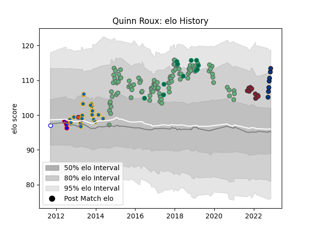

---  
layout: page  
title: Quinn Roux  
date: 2022-11-15 23:39:18.825273  
categories: player  
---
# Quinn Roux

## Positions: L

## Country: Ireland

## Current elo: 113.0

## Current Percentile: 90.0

# Elo History

# Match History

| Team             |   Appearances |   Win Rate |
|:-----------------|--------------:|-----------:|
| Connacht         |           105 |   0.52381  |
| Leinster         |            22 |   0.863636 |
| Ireland          |            11 |   0.636364 |
| Toulon           |            11 |   0.590909 |
| Bath Rugby       |             7 |   0.428571 |
| Stormers         |             4 |   1        |
| Edinburgh        |             1 |   0        |
| Western Province |             1 |   1        |

| Opponent                 |   Matches |   Win Rate |
|:-------------------------|----------:|-----------:|
| Munster                  |        12 |   0.25     |
| Ulster                   |        10 |   0.5      |
| Glasgow Warriors         |        10 |   0.5      |
| Cardiff Blues            |        10 |   0.55     |
| Leinster                 |         9 |   0.444444 |
| Zebre                    |         8 |   0.75     |
| Dragons                  |         8 |   0.75     |
| Edinburgh                |         8 |   0.625    |
| Scarlets                 |         7 |   0.285714 |
| Ospreys                  |         7 |   0.571429 |
| Benetton Treviso         |         7 |   0.857143 |
| Gloucester Rugby         |         4 |   0        |
| Wasps                    |         4 |   0.5      |
| Cheetahs                 |         3 |   1        |
| Castres Olympique        |         3 |   0.333333 |
| Italy                    |         3 |   1        |
| Brive                    |         3 |   1        |
| La Rochelle              |         3 |   1        |
| Bordeaux Begles          |         2 |   1        |
| Perpignan                |         2 |   1        |
| Biarritz Olympique       |         2 |   1        |
| Southern Kings           |         2 |   1        |
| Stade Francais Paris     |         2 |   0.5      |
| Clermont Auvergne        |         2 |   0.5      |
| Connacht                 |         2 |   0.5      |
| Oyonnax                  |         2 |   1        |
| Worcester Warriors       |         2 |   0.75     |
| Wales                    |         2 |   0.5      |
| Stade Toulousain         |         2 |   0        |
| United States of America |         1 |   1        |
| South Africa             |         1 |   0        |
| Scotland                 |         1 |   1        |
| Saracens                 |         1 |   0        |
| Sale Sharks              |         1 |   1        |
| Australia                |         1 |   0        |
| Northampton Saints       |         1 |   1        |
| Newcastle Falcons        |         1 |   1        |
| Montpellier Herault      |         1 |   0.5      |
| Melbourne Rebels         |         1 |   1        |
| Lyon                     |         1 |   1        |
| London Irish             |         1 |   0        |
| Bayonne                  |         1 |   1        |
| Leopards                 |         1 |   1        |
| Leicester Tigers         |         1 |   1        |
| Japan                    |         1 |   1        |
| Grenoble                 |         1 |   0        |
| Exeter Chiefs            |         1 |   0        |
| England                  |         1 |   0        |
| Bulls                    |         1 |   1        |
| Lions                    |         1 |   1        |