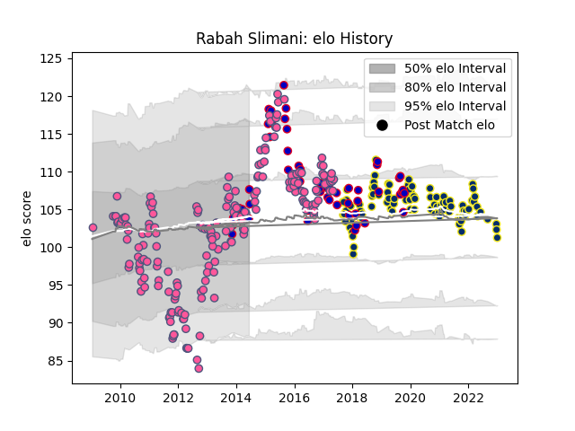

---  
layout: page  
title: Rabah Slimani  
date: 2022-12-18 16:14:50.263289  
categories: player  
---
# Rabah Slimani

## Positions: P

## Country: France

## Current elo: 100.0

## Current Percentile: 71.0

# Elo History

# Match History

| Team                 |   Appearances |   Win Rate |
|:---------------------|--------------:|-----------:|
| Stade Francais Paris |           185 |   0.578378 |
| Clermont Auvergne    |            94 |   0.579787 |
| France               |            53 |   0.462264 |

| Opponent                 |   Matches |   Win Rate |
|:-------------------------|----------:|-----------:|
| Racing 92                |        24 |   0.4375   |
| Toulon                   |        21 |   0.47619  |
| Stade Toulousain         |        20 |   0.225    |
| Castres Olympique        |        16 |   0.5625   |
| Clermont Auvergne        |        15 |   0.466667 |
| Montpellier Herault      |        14 |   0.535714 |
| Bayonne                  |        13 |   0.461538 |
| Bordeaux Begles          |        13 |   0.384615 |
| Brive                    |        13 |   0.538462 |
| Agen                     |        12 |   0.75     |
| Perpignan                |        11 |   0.636364 |
| La Rochelle              |        11 |   0.5      |
| Stade Francais Paris     |         8 |   0.625    |
| Lyon                     |         8 |   0.625    |
| Biarritz Olympique       |         8 |   0.875    |
| Scotland                 |         8 |   0.625    |
| Pau                      |         7 |   0.714286 |
| Italy                    |         7 |   1        |
| England                  |         6 |   0.5      |
| Harlequins               |         6 |   0.666667 |
| Ireland                  |         6 |   0.166667 |
| Bath Rugby               |         5 |   1        |
| Grenoble                 |         5 |   1        |
| Wales                    |         5 |   0.2      |
| South Africa             |         4 |   0        |
| Ulster                   |         4 |   0.5      |
| Northampton Saints       |         4 |   0.75     |
| New Zealand              |         4 |   0        |
| Leicester Tigers         |         4 |   0.25     |
| Argentina                |         4 |   0.75     |
| Ospreys                  |         3 |   1        |
| Australia                |         3 |   0        |
| Bourgoin-Jallieu         |         3 |   1        |
| Cavalieri Prato          |         3 |   1        |
| Oyonnax                  |         3 |   0.666667 |
| Crociati Rugby           |         2 |   1        |
| Bucuresti                |         2 |   1        |
| Saracens                 |         2 |   1        |
| Edinburgh                |         2 |   0.5      |
| Yorkshire Carnegie       |         2 |   1        |
| Mont-de-Marsan           |         2 |   1        |
| London Welsh             |         2 |   1        |
| Munster                  |         2 |   0.5      |
| Albi                     |         2 |   0.5      |
| Fiji                     |         1 |   0        |
| Worcester Warriors       |         1 |   1        |
| United States of America |         1 |   1        |
| Benetton Treviso         |         1 |   1        |
| Tonga                    |         1 |   1        |
| Montauban                |         1 |   0.5      |
| Exeter Chiefs            |         1 |   1        |
| Canada                   |         1 |   1        |
| Japan                    |         1 |   0.5      |
| Samoa                    |         1 |   1        |
| London Irish             |         1 |   1        |
| Gloucester Rugby         |         1 |   1        |
| Leinster                 |         1 |   0        |