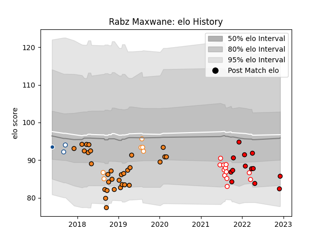

---  
layout: page  
title: Rabz Maxwane  
date: 2022-12-09 13:23:27.817560  
categories: player  
---
# Rabz Maxwane

## Positions: W

## Current elo: 86.0

## Current Percentile: 9.0

# Elo History

# Match History

| Team                |   Appearances |   Win Rate |
|:--------------------|--------------:|-----------:|
| Cheetahs            |            31 |   0.467742 |
| Lions               |            13 |   0.461538 |
| Golden Lions        |            12 |   0.208333 |
| Free State Cheetahs |             6 |   0.333333 |
| Blue Bulls          |             2 |   0.5      |
| Bulls               |             1 |   0        |

| Opponent            |   Matches |   Win Rate |
|:--------------------|----------:|-----------:|
| Griquas             |         5 |   0.6      |
| Scarlets            |         5 |   0.4      |
| Southern Kings      |         5 |   1        |
| Cardiff Blues       |         4 |   0.5      |
| Blue Bulls          |         4 |   0.25     |
| Zebre               |         4 |   0.75     |
| Dragons             |         4 |   0.75     |
| Glasgow Warriors    |         3 |   0        |
| Connacht            |         3 |   0.333333 |
| Munster             |         3 |   0        |
| Ospreys             |         3 |   0.333333 |
| Western Province    |         3 |   0.333333 |
| Edinburgh           |         2 |   0.5      |
| Free State Cheetahs |         2 |   0.25     |
| Golden Lions        |         2 |   0        |
| Natal Sharks        |         2 |   0        |
| Pumas               |         2 |   0        |
| Sharks              |         2 |   0        |
| Ulster              |         2 |   0.25     |
| Stormers            |         1 |   1        |
| Benetton Treviso    |         1 |   1        |
| Leinster            |         1 |   0        |
| Bulls               |         1 |   0        |
| Lions               |         1 |   0        |