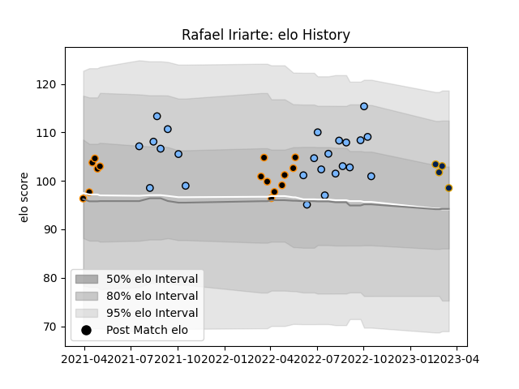

---  
layout: page  
title: Rafael Iriarte  
date: 2023-03-04 11:39:23.147261  
categories: player  
---
# Rafael Iriarte

## Positions: SH

## Current elo: 103.0

## Current Percentile: 71.0

# Elo History

# Match History

| Team        |   Appearances |   Win Rate |
|:------------|--------------:|-----------:|
| CUBA        |            24 |   0.666667 |
| Jaguares XV |            15 |   0.8      |
| Pampas XV   |             3 |   0.666667 |

| Opponent             |   Matches |   Win Rate |
|:---------------------|----------:|-----------:|
| Selknam              |         4 |   0.25     |
| Olimpia Lions        |         4 |   1        |
| Cobras               |         4 |   1        |
| Cafeteros Pro        |         3 |   1        |
| Regatas Bella Vista  |         3 |   0.666667 |
| Hindu                |         3 |   0        |
| Los Tilos            |         3 |   1        |
| Belgrano             |         3 |   1        |
| Buenos Aires         |         2 |   1        |
| Newman               |         2 |   0        |
| Penarol Rugby        |         2 |   0.5      |
| Pucara               |         2 |   1        |
| San Luis             |         2 |   1        |
| CASI                 |         1 |   1        |
| American Raptors     |         1 |   1        |
| Atlético del Rosario |         1 |   1        |
| SIC                  |         1 |   0        |
| Alumni               |         1 |   0        |