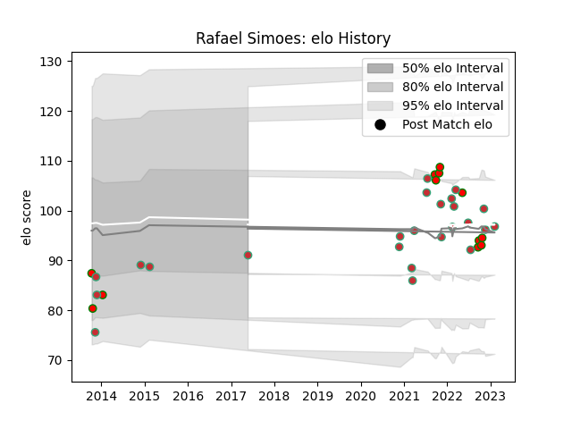

---  
layout: page  
title: Rafael Simoes  
date: 2022-11-22 11:35:55.417259  
categories: player  
---
# Rafael Simoes

## Positions: L, N8

## Country: Portugal

## Current elo: 98.0

## Current Percentile: 61.0

# Elo History

# Match History

| Team         |   Appearances |   Win Rate |
|:-------------|--------------:|-----------:|
| Portugal     |            21 |   0.52381  |
| Lusitanos XV |            11 |   0.636364 |

| Opponent                 |   Matches |   Win Rate |
|:-------------------------|----------:|-----------:|
| Castilla y Leon Iberians |         4 |       0.75 |
| Brussels Devils          |         3 |       1    |
| Brazil                   |         3 |       1    |
| Netherlands              |         2 |       1    |
| Canada                   |         2 |       0.5  |
| Spain                    |         2 |       0.5  |
| Georgia                  |         2 |       0.25 |
| Romania                  |         2 |       0    |
| London Irish             |         2 |       0    |
| Argentina                |         1 |       0    |
| Stade Francais Paris     |         1 |       0    |
| Russia                   |         1 |       1    |
| Italy                    |         1 |       0    |
| Namibia                  |         1 |       1    |
| Japan                    |         1 |       0    |
| Hong Kong                |         1 |       1    |
| Fiji                     |         1 |       0    |
| Delta                    |         1 |       1    |
| United States of America |         1 |       0.5  |