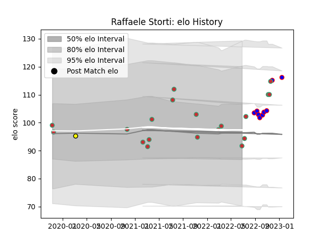

---  
layout: page  
title: Raffaele Storti  
date: 2023-01-15 11:56:58.851751  
categories: player  
---
# Raffaele Storti

## Positions: W

## Country: Portugal

## Current elo: 92.0

## Current Percentile: 45.0

# Elo History

# Match History

| Team          |   Appearances |   Win Rate |
|:--------------|--------------:|-----------:|
| Portugal      |            19 |   0.5      |
| Beziers       |             9 |   0.444444 |
| Penarol Rugby |             1 |   0        |

| Opponent                 |   Matches |   Win Rate |
|:-------------------------|----------:|-----------:|
| Spain                    |         3 |   0.333333 |
| Brazil                   |         2 |   0.5      |
| Georgia                  |         2 |   0        |
| Netherlands              |         2 |   1        |
| Aurillac                 |         2 |   0.5      |
| Argentina                |         1 |   0        |
| Massy                    |         1 |   1        |
| Soyaux-Angouleme         |         1 |   0        |
| Selknam                  |         1 |   0        |
| Russia                   |         1 |   1        |
| Rouen                    |         1 |   1        |
| Romania                  |         1 |   0        |
| Montauban                |         1 |   1        |
| Japan                    |         1 |   0        |
| Kenya                    |         1 |   1        |
| Italy                    |         1 |   0        |
| Hong Kong                |         1 |   1        |
| Grenoble                 |         1 |   0        |
| Colomiers                |         1 |   0        |
| Chile                    |         1 |   1        |
| Carcassonne              |         1 |   0        |
| Canada                   |         1 |   1        |
| United States of America |         1 |   0.5      |