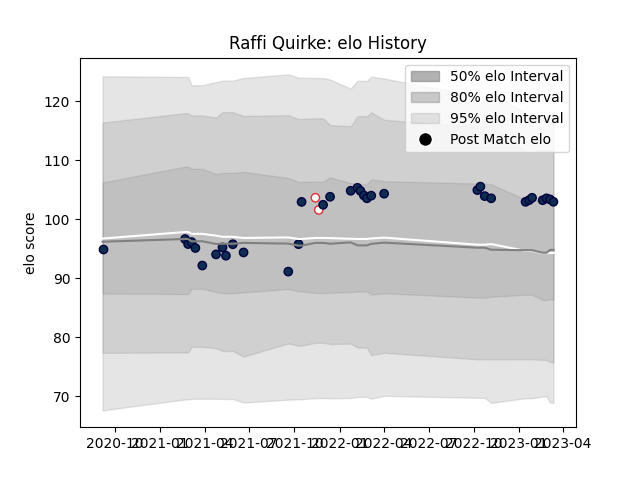

---  
layout: page  
title: Raffi Quirke  
date: 2023-03-21 18:17:15.158329  
categories: player  
---
# Raffi Quirke

Last updated: 2023-03-21
## Positions: SH

## Country: England

## Current elo: 103.0

## Current Percentile: 74.0

# Elo History

# Match History

| Team        |   Appearances |   Win Rate |
|:------------|--------------:|-----------:|
| Sale Sharks |            34 |   0.602941 |
| England     |             2 |   1        |

| Opponent           |   Matches |   Win Rate |
|:-------------------|----------:|-----------:|
| Exeter Chiefs      |         4 |   0.25     |
| Harlequins         |         4 |   0.5      |
| Leicester Tigers   |         3 |   1        |
| London Irish       |         3 |   0.5      |
| Bath Rugby         |         3 |   1        |
| Northampton Saints |         3 |   0.333333 |
| Saracens           |         3 |   0.333333 |
| Worcester Warriors |         2 |   1        |
| Gloucester Rugby   |         2 |   0.5      |
| Ospreys            |         2 |   1        |
| Stade Toulousain   |         1 |   0        |
| Wasps              |         1 |   1        |
| Ulster             |         1 |   0        |
| Australia          |         1 |   1        |
| South Africa       |         1 |   1        |
| Bristol Rugby      |         1 |   1        |
| Newcastle Falcons  |         1 |   1        |