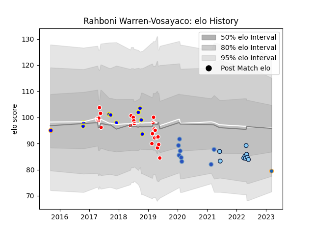

---  
layout: page  
title: Rahboni Warren-Vosayaco  
date: 2023-03-29 11:27:52.988184  
categories: player  
---
# Rahboni Warren-Vosayaco

Last updated: 2023-03-29
## Positions: N8

## Current elo: 92.0

## Current Percentile: 19.0

# Elo History

# Match History

| Team                     |   Appearances |   Win Rate |
|:-------------------------|--------------:|-----------:|
| Sunwolves                |            24 |   0.166667 |
| New South Wales Waratahs |             9 |   0.444444 |
| Urayasu D-Rocks          |             9 |   0.611111 |
| Munakata Sanix Blues     |             8 |   0.375    |
| Western Force            |             2 |   0.5      |
| Greater Sydney Rams      |             1 |   0        |

| Opponent                          |   Matches |   Win Rate |
|:----------------------------------|----------:|-----------:|
| Highlanders                       |         4 |   0        |
| Chiefs                            |         4 |   0.25     |
| New South Wales Waratahs          |         3 |   0.333333 |
| Queensland Reds                   |         3 |   0        |
| Kubota Spears Funabashi Tokyo-Bay |         2 |   0        |
| Melbourne Rebels                  |         2 |   0        |
| Blues                             |         2 |   0        |
| Kobelco Kobe Steelers             |         2 |   0.25     |
| Sharks                            |         2 |   0        |
| Hurricanes                        |         2 |   0        |
| Moana Pasifika                    |         2 |   1        |
| Green Rockets Tokatsu             |         2 |   0.5      |
| Crusaders                         |         2 |   0.5      |
| Bulls                             |         2 |   1        |
| Brumbies                          |         2 |   0        |
| NTT Docomo Red Hurricanes Osaka   |         1 |   1        |
| Shizuoka Blue Revs                |         1 |   0        |
| Toyota Verblitz                   |         1 |   1        |
| Urayasu D-Rocks                   |         1 |   0        |
| Western Force                     |         1 |   1        |
| Toyota Industries Shuttles Aichi  |         1 |   1        |
| Black Rams Tokyo                  |         1 |   0        |
| Munakata Sanix Blues              |         1 |   1        |
| Mie Honda Heat                    |         1 |   1        |
| Lions                             |         1 |   0        |
| Jaguares                          |         1 |   0        |
| Hino Red Dolphins                 |         1 |   1        |
| Hanazono Kintetsu Liners          |         1 |   1        |
| Fijian Drua                       |         1 |   1        |
| Cheetahs                          |         1 |   0        |
| Canberra Vikings                  |         1 |   0        |
| Yokohama Canon Eagles             |         1 |   0        |