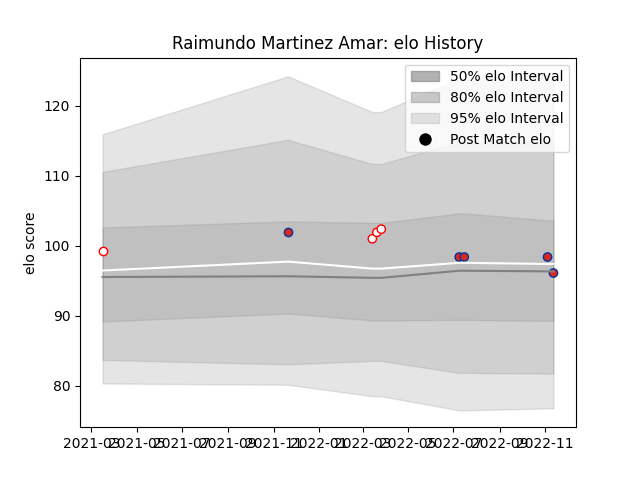

---  
layout: page  
title: Raimundo Martinez Amar  
date: 2022-11-15 23:37:52.905871  
categories: player  
---
# Raimundo Martinez Amar

## Positions: N8, FL

## Country: Chile

## Current elo: 96.0

## Current Percentile: 56.0

# Elo History

# Match History

| Team    |   Appearances |   Win Rate |
|:--------|--------------:|-----------:|
| Chile   |             5 |       0.4  |
| Selknam |             4 |       0.75 |

| Opponent                 |   Matches |   Win Rate |
|:-------------------------|----------:|-----------:|
| United States of America |         2 |        0.5 |
| Cafeteros Pro            |         1 |        1   |
| Cobras                   |         1 |        1   |
| Jaguares XV              |         1 |        1   |
| Olimpia Lions            |         1 |        0   |
| Romania                  |         1 |        0   |
| Russia                   |         1 |        1   |
| Tonga                    |         1 |        0   |