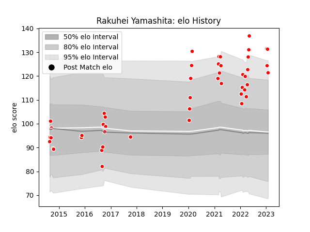

---  
layout: page  
title: Rakuhei Yamashita  
date: 2023-01-13 11:37:02.313376  
categories: player  
---
# Rakuhei Yamashita

## Positions: W

## Current elo: 131.0

## Current Percentile: 98.0

# Elo History

# Match History

| Team                  |   Appearances |   Win Rate |
|:----------------------|--------------:|-----------:|
| Kobelco Kobe Steelers |            44 |   0.795455 |

| Opponent                          |   Matches |   Win Rate |
|:----------------------------------|----------:|-----------:|
| Yokohama Canon Eagles             |         8 |   0.75     |
| Black Rams Tokyo                  |         5 |   1        |
| Green Rockets Tokatsu             |         5 |   1        |
| Saitama Wild Knights              |         4 |   0.125    |
| NTT Docomo Red Hurricanes Osaka   |         3 |   1        |
| Tokyo Sungoliath                  |         3 |   0.666667 |
| Coca-Cola Red Sparks              |         2 |   1        |
| Kubota Spears Funabashi Tokyo-Bay |         2 |   0.5      |
| Shizuoka Blue Revs                |         2 |   1        |
| Toshiba Brave Lupus Tokyo         |         2 |   0.5      |
| Toyota Verblitz                   |         2 |   0.75     |
| Urayasu D-Rocks                   |         2 |   1        |
| Hanazono Kintetsu Liners          |         1 |   1        |
| Hino Red Dolphins                 |         1 |   1        |
| Mie Honda Heat                    |         1 |   1        |
| Toyota Industries Shuttles Aichi  |         1 |   1        |