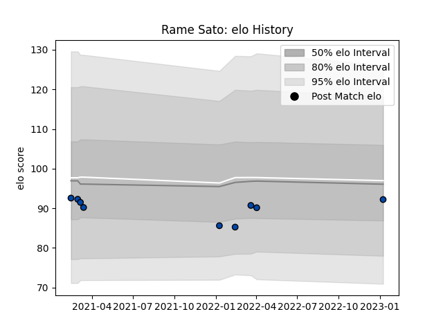

---  
layout: page  
title: Rame Sato  
date: 2023-01-13 11:36:02.880622  
categories: player  
---
# Rame Sato

## Positions: L, FL

## Current elo: 92.0

## Current Percentile: 37.0

# Elo History

# Match History

| Team                |   Appearances |   Win Rate |
|:--------------------|--------------:|-----------:|
| Skyactivs Hiroshima |             9 |   0.222222 |

| Opponent                         |   Matches |   Win Rate |
|:---------------------------------|----------:|-----------:|
| Kamaishi Seawaves                |         2 |        0.5 |
| Chugoku Red Regulions            |         1 |        1   |
| Coca-Cola Red Sparks             |         1 |        0   |
| Hino Red Dolphins                |         1 |        0   |
| Kurita Water Gush                |         1 |        0   |
| Kyuden Voltex                    |         1 |        0   |
| Mitsubishi Dynaboars             |         1 |        0   |
| Toyota Industries Shuttles Aichi |         1 |        0   |