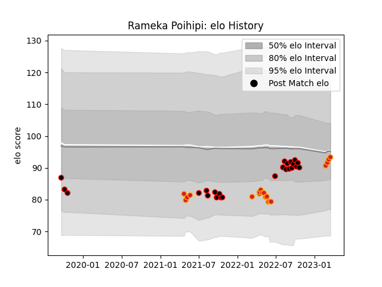

---  
layout: page  
title: Rameka Poihipi  
date: 2023-02-24 09:52:57.145805  
categories: player  
---
# Rameka Poihipi

## Positions: C

## Country: New Zealand Maori

## Current elo: 90.0

## Current Percentile: 39.0

# Elo History

# Match History

| Team              |   Appearances |   Win Rate |
|:------------------|--------------:|-----------:|
| Canterbury        |            22 |   0.636364 |
| Chiefs            |            15 |   0.733333 |
| New Zealand Maori |             2 |   1        |

| Opponent                 |   Matches |   Win Rate |
|:-------------------------|----------:|-----------:|
| Wellington               |         4 |   0.25     |
| Manawatu                 |         3 |   0.666667 |
| Otago                    |         3 |   0.666667 |
| Crusaders                |         3 |   0.333333 |
| Auckland                 |         2 |   0.5      |
| Northland                |         2 |   1        |
| New South Wales Waratahs |         2 |   1        |
| Moana Pasifika           |         2 |   1        |
| Hawke's Bay              |         2 |   0.5      |
| Brumbies                 |         2 |   0.5      |
| Hurricanes               |         1 |   1        |
| Ireland                  |         1 |   1        |
| Melbourne Rebels         |         1 |   1        |
| Bay of Plenty            |         1 |   1        |
| Fijian Drua              |         1 |   1        |
| Counties Manukau         |         1 |   1        |
| Queensland Reds          |         1 |   1        |
| Samoa                    |         1 |   1        |
| Southland                |         1 |   1        |
| Taranaki                 |         1 |   0        |
| Tasman                   |         1 |   1        |
| Waikato                  |         1 |   1        |
| Blues                    |         1 |   0        |
| Western Force            |         1 |   1        |