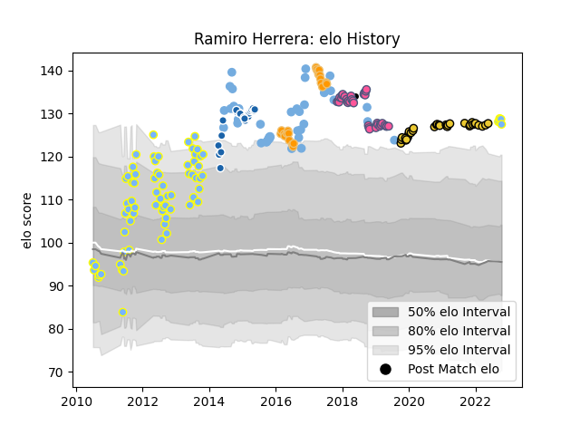

---  
layout: page  
title: Ramiro Herrera  
date: 2023-03-17 17:21:35.387201  
categories: player  
---
# Ramiro Herrera

## Positions: P

## Country: Argentina

## Current elo: 127.0

## Current Percentile: 97.0

# Elo History

# Match History

| Team                 |   Appearances |   Win Rate |
|:---------------------|--------------:|-----------:|
| Hindu                |            72 |   0.805556 |
| Argentina            |            42 |   0.261905 |
| Stade Francais Paris |            38 |   0.447368 |
| La Rochelle          |            33 |   0.575758 |
| Castres Olympique    |            22 |   0.363636 |
| Jaguares             |            22 |   0.409091 |
| Barbarians           |             1 |   1        |

| Opponent                 |   Matches |   Win Rate |
|:-------------------------|----------:|-----------:|
| Toulon                   |         9 |   0.333333 |
| Australia                |         9 |   0.111111 |
| Pau                      |         9 |   0.666667 |
| New Zealand              |         8 |   0        |
| Newman                   |         8 |   0.875    |
| South Africa             |         8 |   0.125    |
| San Luis                 |         7 |   0.857143 |
| Bordeaux Begles          |         7 |   0.714286 |
| Clermont Auvergne        |         7 |   0.571429 |
| Brive                    |         6 |   0.666667 |
| La Plata                 |         6 |   0.666667 |
| SIC                      |         6 |   0.5      |
| CASI                     |         6 |   0.666667 |
| Castres Olympique        |         5 |   0.4      |
| Montpellier Herault      |         5 |   0.8      |
| Lomas                    |         5 |   0.8      |
| Stade Francais Paris     |         5 |   0.4      |
| Belgrano                 |         5 |   0.8      |
| Stade Toulousain         |         5 |   0        |
| Lyon                     |         5 |   0.4      |
| Perpignan                |         4 |   0.75     |
| Racing 92                |         4 |   0.75     |
| Sharks                   |         4 |   0        |
| Agen                     |         4 |   0.5      |
| CUBA                     |         4 |   0.5      |
| England                  |         3 |   0.333333 |
| Atlético del Rosario     |         3 |   1        |
| Bayonne                  |         3 |   0.333333 |
| Ireland                  |         3 |   0.333333 |
| Oyonnax                  |         3 |   0.333333 |
| Pucara                   |         3 |   1        |
| France                   |         3 |   0.666667 |
| Lions                    |         3 |   0.333333 |
| Champagnat               |         2 |   1        |
| Cheetahs                 |         2 |   1        |
| Bulls                    |         2 |   0.5      |
| San Albano               |         2 |   1        |
| San Martin               |         2 |   0.5      |
| Scotland                 |         2 |   0        |
| Southern Kings           |         2 |   0.5      |
| San Andres               |         2 |   1        |
| Worcester Warriors       |         2 |   0        |
| La Rochelle              |         2 |   0.5      |
| Georgia                  |         2 |   1        |
| Leinster                 |         2 |   0        |
| Alumni                   |         2 |   1        |
| Wales                    |         1 |   0        |
| Highlanders              |         1 |   0        |
| Wasps                    |         1 |   0        |
| Tonga                    |         1 |   1        |
| Sunwolves                |         1 |   1        |
| Buenos Aires             |         1 |   1        |
| Hurricanes               |         1 |   0        |
| Biarritz Olympique       |         1 |   0        |
| Italy                    |         1 |   1        |
| Blues                    |         1 |   0        |
| Brumbies                 |         1 |   0        |
| Western Force            |         1 |   0        |
| Japan                    |         1 |   1        |
| Glasgow Warriors         |         1 |   0        |
| Melbourne Rebels         |         1 |   1        |
| San Cirano               |         1 |   1        |
| Namibia                  |         1 |   1        |
| Sale Sharks              |         1 |   0        |
| Liceo Militar            |         1 |   1        |
| Regatas Bella Vista      |         1 |   1        |
| Liceo Naval              |         1 |   1        |
| Queensland Reds          |         1 |   1        |
| Los Tilos                |         1 |   1        |
| Harlequins               |         1 |   0        |
| Olivos                   |         1 |   1        |
| Deportiva Francesa       |         1 |   1        |
| Manuel Belgrano          |         1 |   1        |
| New South Wales Waratahs |         1 |   1        |
| Grenoble                 |         1 |   1        |