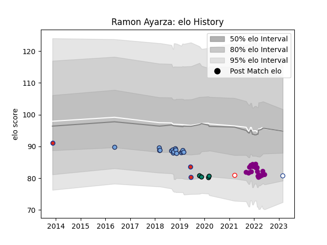

---  
layout: page  
title: Ramon Ayarza  
date: 2023-03-21 18:07:24.822262  
categories: player  
---
# Ramon Ayarza

Last updated: 2023-03-21
## Positions: P, H

## Country: Chile

## Current elo: 82.0

## Current Percentile: 14.0

# Elo History

# Match History

| Team             |   Appearances |   Win Rate |
|:-----------------|--------------:|-----------:|
| Soyaux-Angouleme |            22 |   0.681818 |
| Bayonne          |            15 |   0.533333 |
| Montauban        |             4 |   0.25     |
| Chile            |             3 |   0        |
| Toronto Arrows   |             3 |   0.333333 |
| Selknam          |             1 |   1        |

| Opponent                   |   Matches |   Win Rate |
|:---------------------------|----------:|-----------:|
| Massy                      |         3 |   0.666667 |
| Beziers                    |         3 |   0        |
| Spain                      |         2 |   0        |
| Valence Romans Drome Rugby |         2 |   0.5      |
| Tarbes                     |         2 |   0.5      |
| Bourgoin-Jallieu           |         2 |   1        |
| Suresnes                   |         2 |   1        |
| Carcassonne                |         2 |   0.5      |
| Chambery                   |         2 |   0        |
| Nevers                     |         2 |   0.5      |
| Cognac Saint Jean d'Angély |         2 |   1        |
| Dax                        |         2 |   0.5      |
| Soyaux-Angouleme           |         2 |   0.5      |
| Aubenas                    |         2 |   1        |
| Romania                    |         1 |   0        |
| Albi                       |         1 |   1        |
| Rugby New York             |         1 |   0        |
| Perpignan                  |         1 |   0        |
| US Bressane                |         1 |   1        |
| Provence Rugby             |         1 |   1        |
| Montauban                  |         1 |   1        |
| Oyonnax                    |         1 |   1        |
| Old Glory DC               |         1 |   0        |
| Nice                       |         1 |   0        |
| Grenoble                   |         1 |   0        |
| Dijon                      |         1 |   1        |
| Chicago Hounds             |         1 |   1        |
| Cafeteros Pro              |         1 |   1        |
| Blagnac                    |         1 |   1        |
| Biarritz Olympique         |         1 |   0        |
| Aurillac                   |         1 |   0        |
| Vannes                     |         1 |   1        |