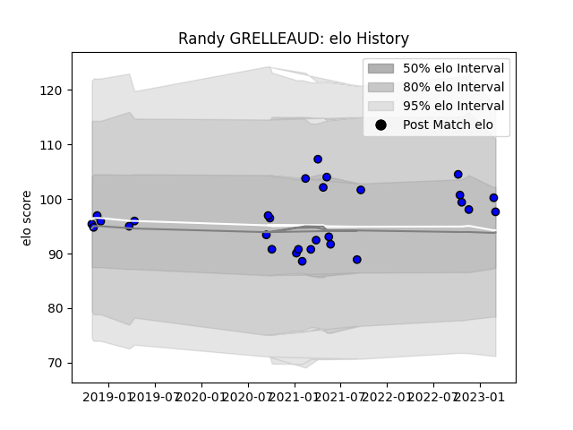

---  
layout: page  
title: Randy GRELLEAUD  
date: 2023-03-09 10:11:09.981858  
categories: player  
---
# Randy GRELLEAUD

## Positions: H

## Current elo: 98.0

## Current Percentile: 70.0

# Elo History

# Match History

| Team   |   Appearances |   Win Rate |
|:-------|--------------:|-----------:|
| Massy  |            29 |   0.413793 |

| Opponent                   |   Matches |   Win Rate |
|:---------------------------|----------:|-----------:|
| Biarritz Olympique         |         3 |   0.333333 |
| Blagnac                    |         3 |   0.333333 |
| Tarbes                     |         2 |   0.5      |
| Carcassonne                |         2 |   0.5      |
| Aubenas                    |         2 |   1        |
| Nice                       |         2 |   0        |
| Albi                       |         1 |   1        |
| Oyonnax                    |         1 |   0        |
| US Bressane                |         1 |   1        |
| Suresnes                   |         1 |   1        |
| Soyaux-Angouleme           |         1 |   1        |
| Rouen                      |         1 |   0        |
| Provence Rugby             |         1 |   1        |
| Mont-de-Marsan             |         1 |   0        |
| Narbonne                   |         1 |   0        |
| Dijon                      |         1 |   0        |
| Cognac Saint Jean d'Angély |         1 |   1        |
| Chambery                   |         1 |   0        |
| Beziers                    |         1 |   0        |
| Aurillac                   |         1 |   0        |
| Vannes                     |         1 |   0        |