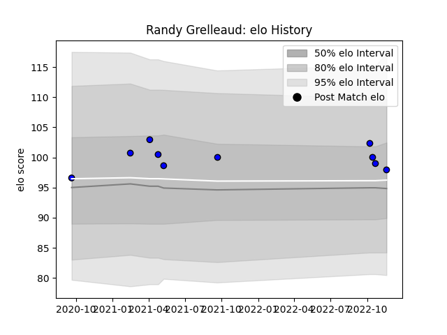

---  
layout: page  
title: Randy Grelleaud  
date: 2022-11-22 11:39:32.952540  
categories: player  
---
# Randy Grelleaud

## Positions: H

## Current elo: 98.0

## Current Percentile: 68.0

# Elo History

# Match History

| Team   |   Appearances |   Win Rate |
|:-------|--------------:|-----------:|
| Massy  |            10 |        0.4 |

| Opponent           |   Matches |   Win Rate |
|:-------------------|----------:|-----------:|
| Beziers            |         1 |          0 |
| Biarritz Olympique |         1 |          0 |
| Blagnac            |         1 |          1 |
| Carcassonne        |         1 |          1 |
| Chambery           |         1 |          0 |
| Dijon              |         1 |          0 |
| Nice               |         1 |          0 |
| Soyaux-Angouleme   |         1 |          1 |
| Suresnes           |         1 |          1 |
| Vannes             |         1 |          0 |