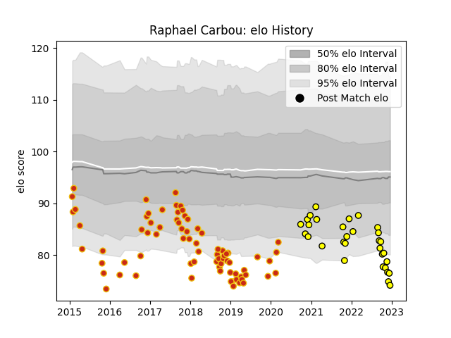

---  
layout: page  
title: Raphael Carbou  
date: 2022-12-14 11:20:35.297514  
categories: player  
---
# Raphael Carbou

## Positions: H

## Current elo: 76.0

## Current Percentile: 2.0

# Elo History

# Match History

| Team        |   Appearances |   Win Rate |
|:------------|--------------:|-----------:|
| Perpignan   |            75 |   0.44     |
| Carcassonne |            30 |   0.533333 |

| Opponent                   |   Matches |   Win Rate |
|:---------------------------|----------:|-----------:|
| Biarritz Olympique         |        10 |   0.7      |
| Montauban                  |         7 |   0.714286 |
| Grenoble                   |         7 |   0.571429 |
| Colomiers                  |         6 |   0.583333 |
| Mont-de-Marsan             |         5 |   0.4      |
| Narbonne                   |         5 |   0.8      |
| Vannes                     |         5 |   0.6      |
| Aurillac                   |         5 |   0.2      |
| Bordeaux Begles            |         4 |   0.125    |
| Agen                       |         4 |   0.5      |
| Beziers                    |         3 |   0.666667 |
| Lyon                       |         3 |   0        |
| Massy                      |         3 |   0.333333 |
| Provence Rugby             |         3 |   0.333333 |
| Clermont Auvergne          |         2 |   0        |
| Nevers                     |         2 |   1        |
| Stade Francais Paris       |         2 |   0        |
| Soyaux-Angouleme           |         2 |   0.5      |
| Racing 92                  |         2 |   0        |
| Perpignan                  |         2 |   0        |
| Pau                        |         2 |   0        |
| Oyonnax                    |         2 |   0.5      |
| Carcassonne                |         2 |   1        |
| Montpellier Herault        |         2 |   0.5      |
| Bayonne                    |         2 |   0.5      |
| La Rochelle                |         2 |   0        |
| Dax                        |         2 |   1        |
| Castres Olympique          |         1 |   0        |
| Albi                       |         1 |   1        |
| Rouen                      |         1 |   1        |
| Connacht                   |         1 |   0        |
| Stade Toulousain           |         1 |   0        |
| Tarbes                     |         1 |   1        |
| Toulon                     |         1 |   0        |
| Valence Romans Drome Rugby |         1 |   0        |
| Bourgoin-Jallieu           |         1 |   0        |