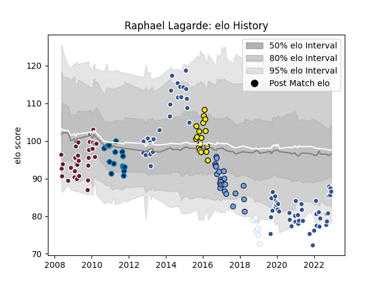

---  
layout: page  
title: Raphael Lagarde  
date: 2022-11-22 11:26:36.225028  
categories: player  
---
# Raphael Lagarde

## Positions: FH

## Current elo: 85.0

## Current Percentile: 18.0

# Elo History

# Match History

| Team                |   Appearances |   Win Rate |
|:--------------------|--------------:|-----------:|
| Agen                |            68 |   0.338235 |
| Bordeaux Begles     |            30 |   0.466667 |
| Bayonne             |            24 |   0.25     |
| Albi                |            17 |   0.529412 |
| Montpellier Herault |            15 |   0.366667 |
| Racing 92           |             8 |   0.625    |

| Opponent             |   Matches |   Win Rate |
|:---------------------|----------:|-----------:|
| Pau                  |         9 |  0.388889  |
| Mont-de-Marsan       |         7 |  0.714286  |
| Aurillac             |         7 |  0.571429  |
| La Rochelle          |         7 |  0.285714  |
| Bayonne              |         7 |  0.357143  |
| Bordeaux Begles      |         7 |  0.142857  |
| Bourgoin-Jallieu     |         6 |  0.333333  |
| Narbonne             |         6 |  0.5       |
| Perpignan            |         6 |  0.5       |
| Colomiers            |         6 |  0.5       |
| Racing 92            |         6 |  0.0833333 |
| Montpellier Herault  |         5 |  0.4       |
| Provence Rugby       |         5 |  0.4       |
| Oyonnax              |         5 |  0.2       |
| Lyon                 |         5 |  0.1       |
| Stade Francais Paris |         4 |  0.125     |
| Castres Olympique    |         4 |  0         |
| Clermont Auvergne    |         4 |  0         |
| Tarbes               |         4 |  0.75      |
| Grenoble             |         4 |  0.5       |
| Toulon               |         4 |  0.25      |
| Brive                |         3 |  0.333333  |
| Stade Toulousain     |         3 |  0.333333  |
| Beziers              |         3 |  0         |
| Auch                 |         3 |  0.333333  |
| Nevers               |         2 |  0.5       |
| Agen                 |         2 |  0.5       |
| Vannes               |         2 |  1         |
| Montauban            |         2 |  0         |
| Bath Rugby           |         2 |  0         |
| Benetton Treviso     |         2 |  0         |
| Biarritz Olympique   |         2 |  1         |
| Edinburgh            |         2 |  0         |
| Dax                  |         2 |  0.5       |
| Carcassonne          |         2 |  0.5       |
| Calvisano            |         2 |  1         |
| Soyaux-Angouleme     |         1 |  0         |
| US Bressane          |         1 |  0         |
| Rouen                |         1 |  1         |
| Scarlets             |         1 |  1         |
| Massy                |         1 |  1         |
| Exeter Chiefs        |         1 |  1         |
| Lannemezan           |         1 |  1         |
| Newcastle Falcons    |         1 |  1         |
| Albi                 |         1 |  1         |
| Limoges              |         1 |  1         |