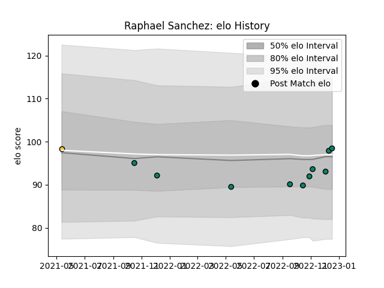

---  
layout: page  
title: Raphael Sanchez  
date: 2022-12-18 16:31:15.663103  
categories: player  
---
# Raphael Sanchez

## Positions: FB, C

## Current elo: 98.0

## Current Percentile: 57.0

# Elo History

# Match History

| Team        |   Appearances |   Win Rate |
|:------------|--------------:|-----------:|
| Montauban   |            10 |       0.25 |
| La Rochelle |             1 |       0    |

| Opponent         |   Matches |   Win Rate |
|:-----------------|----------:|-----------:|
| Oyonnax          |         2 |        0   |
| Aurillac         |         1 |        0   |
| Beziers          |         1 |        0   |
| Brive            |         1 |        0   |
| Grenoble         |         1 |        0.5 |
| Massy            |         1 |        1   |
| Nevers           |         1 |        0   |
| Provence Rugby   |         1 |        0   |
| Rouen            |         1 |        0   |
| Soyaux-Angouleme |         1 |        1   |