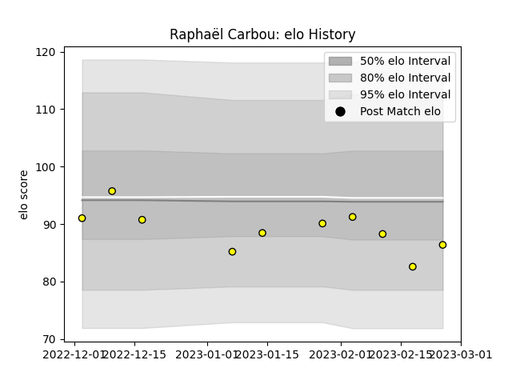

---  
layout: page  
title: Raphaël CARBOU  
date: 2023-01-17 11:40:38.707153  
categories: player  
---
# Raphaël CARBOU

## Positions: H

## Current elo: 88.0

## Current Percentile: 20.0

# Elo History

# Match History

| Team        |   Appearances |   Win Rate |
|:------------|--------------:|-----------:|
| Perpignan   |           125 |   0.488    |
| Carcassonne |            60 |   0.558333 |

| Opponent                   |   Matches |   Win Rate |
|:---------------------------|----------:|-----------:|
| Colomiers                  |        13 |   0.423077 |
| Montauban                  |        12 |   0.75     |
| Beziers                    |        12 |   0.666667 |
| Aurillac                   |        11 |   0.545455 |
| Grenoble                   |        11 |   0.5      |
| Biarritz Olympique         |        11 |   0.636364 |
| Vannes                     |        10 |   0.6      |
| Mont-de-Marsan             |         8 |   0.25     |
| Narbonne                   |         8 |   0.75     |
| Dax                        |         7 |   0.571429 |
| Carcassonne                |         7 |   0.714286 |
| Agen                       |         6 |   0.5      |
| Soyaux-Angouleme           |         6 |   0.666667 |
| Rouen                      |         5 |   1        |
| Oyonnax                    |         5 |   0.2      |
| Provence Rugby             |         4 |   0.25     |
| Albi                       |         4 |   0.25     |
| Nevers                     |         4 |   1        |
| Massy                      |         4 |   0.5      |
| Bordeaux Begles            |         4 |   0.125    |
| Bayonne                    |         4 |   0.75     |
| Lyon                       |         3 |   0        |
| Pau                        |         3 |   0.333333 |
| Tarbes                     |         2 |   0.5      |
| Stade Francais Paris       |         2 |   0        |
| Racing 92                  |         2 |   0        |
| Clermont Auvergne          |         2 |   0        |
| Perpignan                  |         2 |   0        |
| La Rochelle                |         2 |   0        |
| Montpellier Herault        |         2 |   0.5      |
| Bourgoin-Jallieu           |         2 |   0.5      |
| Connacht                   |         1 |   0        |
| Roval Drome XV             |         1 |   1        |
| Castres Olympique          |         1 |   0        |
| Stade Toulousain           |         1 |   0        |
| Toulon                     |         1 |   0        |
| US Bressane                |         1 |   1        |
| Valence Romans Drome Rugby |         1 |   0        |