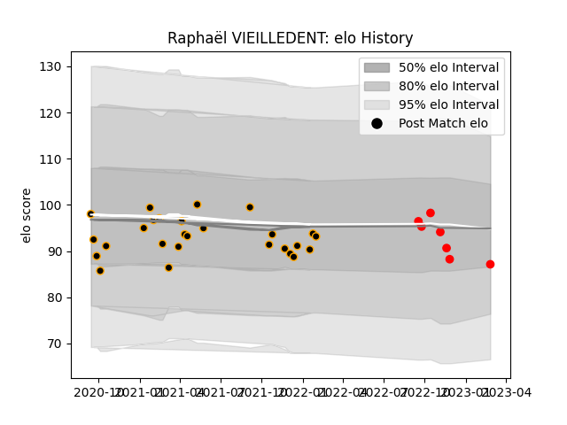

---  
layout: page  
title: Raphaël VIEILLEDENT  
date: 2023-03-30 11:30:51.019772  
categories: player  
---
# Raphaël VIEILLEDENT

Last updated: 2023-03-30
## Positions: L

## Current elo: 90.0

## Current Percentile: 33.0

# Elo History

# Match History

| Team     |   Appearances |   Win Rate |
|:---------|--------------:|-----------:|
| Chambery |            27 |   0.388889 |
| Rouen    |             9 |   0.222222 |

| Opponent                   |   Matches |   Win Rate |
|:---------------------------|----------:|-----------:|
| Massy                      |         4 |   0.625    |
| Nice                       |         3 |   0        |
| Dax                        |         3 |   0.333333 |
| Aubenas                    |         2 |   0        |
| US Bressane                |         2 |   0        |
| Bourgoin-Jallieu           |         2 |   0.5      |
| Suresnes                   |         2 |   1        |
| Dijon                      |         2 |   0.5      |
| Albi                       |         2 |   0        |
| Agen                       |         1 |   0        |
| Valence Romans Drome Rugby |         1 |   0        |
| Tarbes                     |         1 |   1        |
| Soyaux-Angouleme           |         1 |   1        |
| Oyonnax                    |         1 |   0        |
| Grenoble                   |         1 |   0        |
| Narbonne                   |         1 |   1        |
| Mont-de-Marsan             |         1 |   1        |
| Cognac Saint Jean d'Angély |         1 |   1        |
| Carcassonne                |         1 |   0        |
| Blagnac                    |         1 |   0        |
| Beziers                    |         1 |   0        |
| Aurillac                   |         1 |   0        |
| Vannes                     |         1 |   0        |