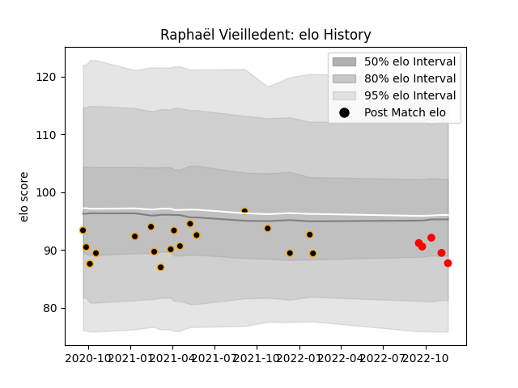

---  
layout: page  
title: Raphaël Vieilledent  
date: 2022-11-22 11:37:41.073478  
categories: player  
---
# Raphaël Vieilledent

## Positions: L

## Current elo: 88.0

## Current Percentile: 26.0

# Elo History

# Match History

| Team     |   Appearances |   Win Rate |
|:---------|--------------:|-----------:|
| Chambery |            18 |   0.444444 |
| Rouen    |             5 |   0.2      |

| Opponent                   |   Matches |   Win Rate |
|:---------------------------|----------:|-----------:|
| US Bressane                |         2 |        0   |
| Bourgoin-Jallieu           |         2 |        0.5 |
| Dax                        |         2 |        0.5 |
| Suresnes                   |         2 |        1   |
| Nice                       |         2 |        0   |
| Agen                       |         1 |        0   |
| Narbonne                   |         1 |        1   |
| Tarbes                     |         1 |        1   |
| Soyaux-Angouleme           |         1 |        1   |
| Oyonnax                    |         1 |        0   |
| Mont-de-Marsan             |         1 |        1   |
| Albi                       |         1 |        0   |
| Massy                      |         1 |        1   |
| Grenoble                   |         1 |        0   |
| Dijon                      |         1 |        0   |
| Carcassonne                |         1 |        0   |
| Blagnac                    |         1 |        0   |
| Valence Romans Drome Rugby |         1 |        0   |