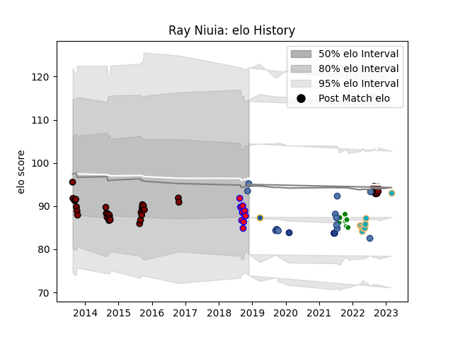

---  
layout: page  
title: Ray Niuia  
date: 2023-03-17 17:23:26.356851  
categories: player  
---
# Ray Niuia

## Positions: H

## Country: Samoa

## Current elo: 95.0

## Current Percentile: 18.0

# Elo History

# Match History

| Team           |   Appearances |   Win Rate |
|:---------------|--------------:|-----------:|
| North Harbour  |            37 |   0.351351 |
| Samoa          |            14 |   0.5      |
| Moana Pasifika |            11 |   0.181818 |
| Tasman         |            11 |   0.818182 |
| Manawatu       |             7 |   0.285714 |
| Blues          |             3 |   0.666667 |
| Highlanders    |             1 |   0        |

| Opponent                 |   Matches |   Win Rate |
|:-------------------------|----------:|-----------:|
| Canterbury               |         7 |   0.285714 |
| Southland                |         6 |   0.666667 |
| Hawke's Bay              |         6 |   0.333333 |
| Auckland                 |         5 |   0        |
| Counties Manukau         |         5 |   0.8      |
| Otago                    |         5 |   0.2      |
| Chiefs                   |         4 |   0        |
| Wellington               |         4 |   0.5      |
| Northland                |         4 |   0.75     |
| Tonga                    |         4 |   1        |
| Tasman                   |         3 |   0.666667 |
| Taranaki                 |         3 |   0.666667 |
| Manawatu                 |         3 |   0.333333 |
| Blues                    |         2 |   0        |
| Hurricanes               |         2 |   0.5      |
| Bay of Plenty            |         2 |   0        |
| New Zealand Maori        |         2 |   0        |
| Waikato                  |         1 |   0        |
| United States of America |         1 |   0        |
| Russia                   |         1 |   1        |
| Spain                    |         1 |   1        |
| Scotland                 |         1 |   0        |
| New South Wales Waratahs |         1 |   0        |
| Queensland Reds          |         1 |   0        |
| North Harbour            |         1 |   1        |
| Australia                |         1 |   0        |
| Melbourne Rebels         |         1 |   0        |
| Japan                    |         1 |   0        |
| Ireland                  |         1 |   0        |
| Highlanders              |         1 |   1        |
| Fijian Drua              |         1 |   0        |
| Fiji                     |         1 |   1        |
| Brumbies                 |         1 |   1        |
| Western Force            |         1 |   1        |