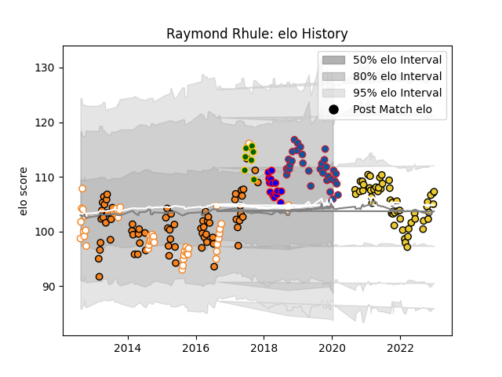

---  
layout: page  
title: Raymond Rhule  
date: 2023-01-06 00:16:11.246389  
categories: player  
---
# Raymond Rhule

## Positions: W, C

## Country: South Africa

## Current elo: 106.0

## Current Percentile: 67.0

# Elo History

# Match History

| Team                |   Appearances |   Win Rate |
|:--------------------|--------------:|-----------:|
| Cheetahs            |            69 |   0.376812 |
| La Rochelle         |            53 |   0.584906 |
| Free State Cheetahs |            49 |   0.489796 |
| Grenoble            |            33 |   0.424242 |
| Stormers            |            15 |   0.333333 |
| South Africa        |             7 |   0.785714 |

| Opponent                 |   Matches |   Win Rate |
|:-------------------------|----------:|-----------:|
| Bulls                    |        11 |   0.272727 |
| Sharks                   |        10 |   0.4      |
| Griquas                  |        10 |   0.9      |
| Blue Bulls               |         9 |   0.444444 |
| Stade Toulousain         |         9 |   0        |
| Golden Lions             |         8 |   0.375    |
| Natal Sharks             |         8 |   0.3125   |
| Stormers                 |         8 |   0.25     |
| Pau                      |         7 |   0.571429 |
| Bordeaux Begles          |         7 |   0.714286 |
| Lions                    |         7 |   0        |
| Western Province         |         7 |   0.285714 |
| Montpellier Herault      |         6 |   0.333333 |
| Lyon                     |         6 |   0.666667 |
| Racing 92                |         6 |   0.5      |
| Sunwolves                |         5 |   0.8      |
| Toulon                   |         5 |   0.8      |
| Perpignan                |         5 |   0.6      |
| Clermont Auvergne        |         4 |   0.375    |
| Chiefs                   |         4 |   0        |
| Western Force            |         4 |   0.75     |
| Highlanders              |         4 |   0.25     |
| Castres Olympique        |         4 |   0.5      |
| Blues                    |         4 |   0.75     |
| Southern Kings           |         4 |   1        |
| Pumas                    |         4 |   0.125    |
| New South Wales Waratahs |         3 |   0.333333 |
| Queensland Reds          |         3 |   0.666667 |
| Melbourne Rebels         |         3 |   0.333333 |
| Jaguares                 |         3 |   0.333333 |
| Hurricanes               |         3 |   0        |
| France                   |         3 |   1        |
| Crusaders                |         3 |   0        |
| Stade Francais Paris     |         3 |   0.333333 |
| Brumbies                 |         3 |   0        |
| Brive                    |         3 |   1        |
| Oyonnax                  |         2 |   0.5      |
| Soyaux-Angouleme         |         2 |   1        |
| Agen                     |         2 |   0.75     |
| Nevers                   |         2 |   0.5      |
| Aurillac                 |         2 |   1        |
| Argentina                |         2 |   1        |
| La Rochelle              |         2 |   0        |
| Eastern Province Kings   |         2 |   1        |
| Ospreys                  |         1 |   1        |
| Beziers                  |         1 |   1        |
| Australia                |         1 |   0.5      |
| Vannes                   |         1 |   0        |
| Ulster                   |         1 |   1        |
| Bayonne                  |         1 |   1        |
| Carcassonne              |         1 |   1        |
| Biarritz Olympique       |         1 |   0        |
| Boland Cavaliers         |         1 |   1        |
| New Zealand              |         1 |   0        |
| Rouen                    |         1 |   1        |
| Mont-de-Marsan           |         1 |   0        |
| Montauban                |         1 |   0        |
| Zebre                    |         1 |   1        |