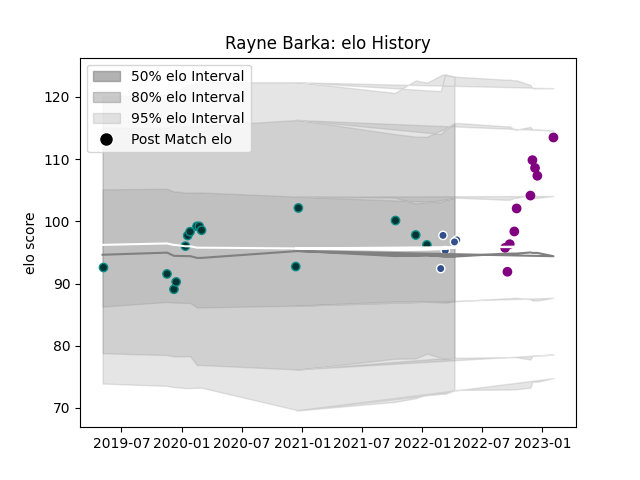

---  
layout: page  
title: Rayne Barka  
date: 2022-12-09 13:04:33.760856  
categories: player  
---
# Rayne Barka

## Positions: H

## Current elo: 102.0

## Current Percentile: 65.0

# Elo History

# Match History

| Team             |   Appearances |   Win Rate |
|:-----------------|--------------:|-----------:|
| Pau              |            14 |   0.285714 |
| Soyaux-Angouleme |             7 |   0.428571 |
| Agen             |             2 |   0        |

| Opponent            |   Matches |   Win Rate |
|:--------------------|----------:|-----------:|
| Aurillac            |         2 |        0   |
| Brive               |         2 |        0   |
| Cardiff Blues       |         2 |        0.5 |
| Leicester Tigers    |         2 |        0.5 |
| London Irish        |         2 |        0   |
| Oyonnax             |         2 |        0   |
| Stade Toulousain    |         2 |        0   |
| Beziers             |         1 |        1   |
| Calvisano           |         1 |        1   |
| Carcassonne         |         1 |        1   |
| Castres Olympique   |         1 |        0   |
| Clermont Auvergne   |         1 |        0   |
| Massy               |         1 |        1   |
| Mont-de-Marsan      |         1 |        0   |
| Montpellier Herault |         1 |        1   |
| Provence Rugby      |         1 |        0   |