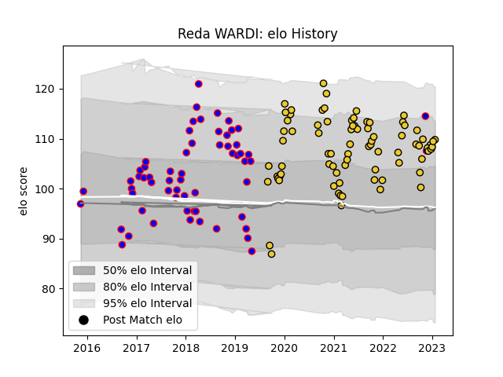

---  
layout: page  
title: Reda WARDI  
date: 2023-01-23 15:33:13.560400  
categories: player  
---
# Reda WARDI

## Positions: P

## Country: France

## Current elo: 116.0

## Current Percentile: 92.0

# Elo History

# Match History

| Team        |   Appearances |   Win Rate |
|:------------|--------------:|-----------:|
| La Rochelle |            74 |   0.608108 |
| Beziers     |            58 |   0.534483 |
| France      |             2 |   1        |

| Opponent             |   Matches |   Win Rate |
|:---------------------|----------:|-----------:|
| Stade Toulousain     |         9 |   0.222222 |
| Bayonne              |         8 |   0.5      |
| Biarritz Olympique   |         6 |   0.5      |
| Stade Francais Paris |         6 |   0.5      |
| Racing 92            |         6 |   0.5      |
| Lyon                 |         5 |   0.8      |
| Toulon               |         5 |   1        |
| Bordeaux Begles      |         5 |   0.6      |
| Castres Olympique    |         5 |   0.8      |
| Perpignan            |         5 |   0.6      |
| Montpellier Herault  |         5 |   0.6      |
| Agen                 |         4 |   1        |
| Mont-de-Marsan       |         4 |   0.25     |
| Massy                |         4 |   1        |
| Vannes               |         4 |   0.25     |
| Clermont Auvergne    |         4 |   0.25     |
| Aurillac             |         4 |   0.5      |
| Brive                |         4 |   0.5      |
| Carcassonne          |         4 |   0.75     |
| Nevers               |         3 |   0.833333 |
| Soyaux-Angouleme     |         3 |   0.333333 |
| Pau                  |         3 |   1        |
| Montauban            |         3 |   0.166667 |
| Narbonne             |         3 |   0.666667 |
| Dax                  |         3 |   1        |
| Northampton Saints   |         2 |   1        |
| Glasgow Warriors     |         2 |   0.5      |
| Provence Rugby       |         2 |   0.5      |
| Colomiers            |         2 |   0.5      |
| Sale Sharks          |         2 |   0.5      |
| Bourgoin-Jallieu     |         2 |   1        |
| Oyonnax              |         1 |   0        |
| South Africa         |         1 |   1        |
| Albi                 |         1 |   0        |
| Exeter Chiefs        |         1 |   0        |
| US Bressane          |         1 |   0        |
| Ulster               |         1 |   1        |
| Japan                |         1 |   1        |