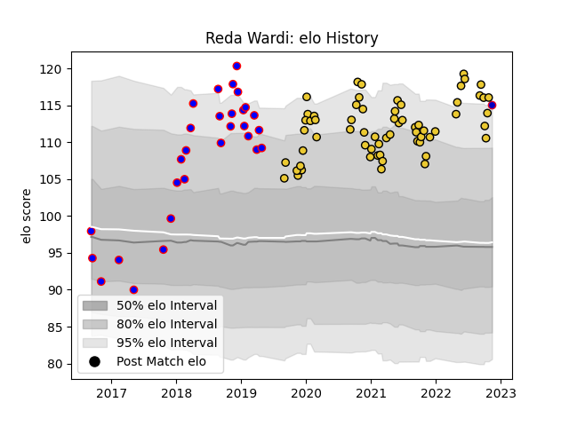

---  
layout: page  
title: Reda Wardi  
date: 2022-11-15 23:45:18.333867  
categories: player  
---
# Reda Wardi

## Positions: P

## Country: France

## Current elo: 115.0

## Current Percentile: 95.0

# Elo History

# Match History

| Team        |   Appearances |   Win Rate |
|:------------|--------------:|-----------:|
| La Rochelle |            64 |   0.59375  |
| Beziers     |            29 |   0.568966 |
| France      |             1 |   1        |

| Opponent             |   Matches |   Win Rate |
|:---------------------|----------:|-----------:|
| Stade Toulousain     |         7 |   0        |
| Racing 92            |         6 |   0.5      |
| Montpellier Herault  |         5 |   0.6      |
| Toulon               |         5 |   1        |
| Stade Francais Paris |         5 |   0.6      |
| Lyon                 |         5 |   0.8      |
| Agen                 |         4 |   1        |
| Bayonne              |         4 |   0.75     |
| Bordeaux Begles      |         4 |   0.75     |
| Brive                |         4 |   0.5      |
| Castres Olympique    |         4 |   0.75     |
| Clermont Auvergne    |         4 |   0.25     |
| Perpignan            |         4 |   0.5      |
| Massy                |         4 |   1        |
| Pau                  |         3 |   1        |
| Mont-de-Marsan       |         3 |   0.333333 |
| Carcassonne          |         3 |   0.666667 |
| Nevers               |         2 |   0.75     |
| Glasgow Warriors     |         2 |   0.5      |
| Sale Sharks          |         2 |   0.5      |
| Soyaux-Angouleme     |         2 |   0        |
| Biarritz Olympique   |         2 |   1        |
| Vannes               |         2 |   0.5      |
| Montauban            |         1 |   0        |
| Aurillac             |         1 |   0        |
| Oyonnax              |         1 |   0        |
| Exeter Chiefs        |         1 |   0        |
| Provence Rugby       |         1 |   0        |
| Dax                  |         1 |   1        |
| South Africa         |         1 |   1        |
| Colomiers            |         1 |   1        |