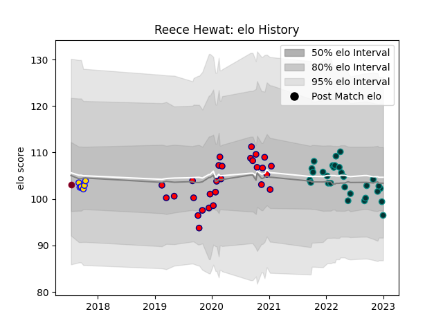

---  
layout: page  
title: Reece Hewat  
date: 2022-12-09 13:04:41.897061  
categories: player  
---
# Reece Hewat

## Positions: FL, N8

## Current elo: 96.0

## Current Percentile: 42.0

# Elo History

# Match History

| Team            |   Appearances |   Win Rate |
|:----------------|--------------:|-----------:|
| Pau             |            26 |   0.423077 |
| Aurillac        |            24 |   0.458333 |
| Brisbane City   |             4 |   0.75     |
| Queensland Reds |             1 |   0        |

| Opponent                   |   Matches |   Win Rate |
|:---------------------------|----------:|-----------:|
| Beziers                    |         4 |   0.25     |
| Perpignan                  |         4 |   0.75     |
| Stade Toulousain           |         3 |   0.666667 |
| Rouen                      |         3 |   0.666667 |
| Vannes                     |         3 |   0.333333 |
| Brive                      |         3 |   0.333333 |
| Castres Olympique          |         2 |   0        |
| Racing 92                  |         2 |   0        |
| Grenoble                   |         2 |   0.5      |
| Bordeaux Begles            |         2 |   0.5      |
| La Rochelle                |         2 |   0.5      |
| Biarritz Olympique         |         2 |   0.5      |
| Mont-de-Marsan             |         2 |   0.5      |
| Clermont Auvergne          |         2 |   0.5      |
| Nevers                     |         2 |   0.5      |
| Carcassonne                |         2 |   1        |
| Provence Rugby             |         2 |   0.5      |
| Valence Romans Drome Rugby |         1 |   1        |
| Toulon                     |         1 |   0        |
| Sydney Rays                |         1 |   1        |
| Stade Francais Paris       |         1 |   0        |
| Montpellier Herault        |         1 |   1        |
| Queensland Country         |         1 |   0        |
| Lyon                       |         1 |   0        |
| London Irish               |         1 |   0        |
| Highlanders                |         1 |   0        |
| Fijian Drua                |         1 |   1        |
| Edinburgh                  |         1 |   0        |
| Colomiers                  |         1 |   0        |
| Melbourne Rising           |         1 |   1        |