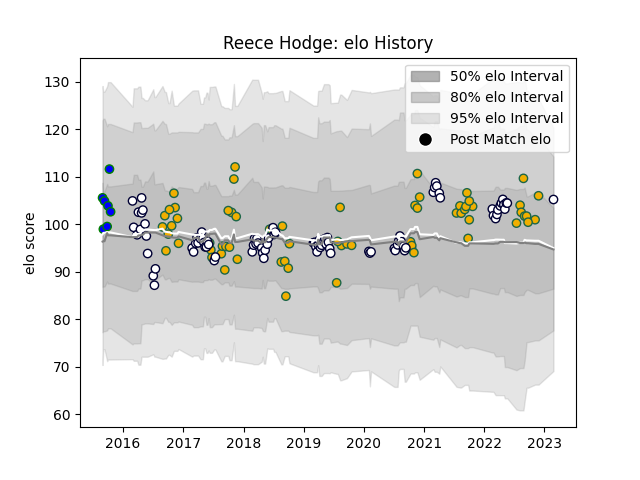

---  
layout: page  
title: Reece Hodge  
date: 2023-03-17 17:42:48.138267  
categories: player  
---
# Reece Hodge

## Positions: C, FB

## Country: Australia

## Current elo: 107.0

## Current Percentile: 80.0

# Elo History

# Match History

| Team               |   Appearances |   Win Rate |
|:-------------------|--------------:|-----------:|
| Melbourne Rebels   |            92 |   0.347826 |
| Australia          |            66 |   0.484848 |
| North Harbour Rays |             7 |   0.285714 |

| Opponent                 |   Matches |   Win Rate |
|:-------------------------|----------:|-----------:|
| New Zealand              |        19 |   0.184211 |
| Argentina                |        15 |   0.766667 |
| New South Wales Waratahs |        13 |   0.384615 |
| Queensland Reds          |        13 |   0.346154 |
| South Africa             |        11 |   0.545455 |
| Brumbies                 |        11 |   0.454545 |
| Western Force            |        10 |   0.6      |
| Hurricanes               |         6 |   0        |
| Crusaders                |         5 |   0        |
| Sunwolves                |         5 |   0.8      |
| Ireland                  |         4 |   0.25     |
| England                  |         4 |   0        |
| Chiefs                   |         4 |   0        |
| Highlanders              |         4 |   0.25     |
| Blues                    |         4 |   0.25     |
| Stormers                 |         3 |   0        |
| Scotland                 |         3 |   0.333333 |
| Sharks                   |         3 |   0.5      |
| Bulls                    |         3 |   0        |
| Wales                    |         3 |   1        |
| Japan                    |         2 |   1        |
| Lions                    |         2 |   0        |
| France                   |         2 |   0.5      |
| Fiji                     |         2 |   1        |
| Queensland Country       |         1 |   1        |
| Southern Kings           |         1 |   0        |
| Brisbane City            |         1 |   0        |
| Cheethas                 |         1 |   1        |
| Melbourne Rising         |         1 |   0        |
| Perth Spirit             |         1 |   1        |
| Canberra Vikings         |         1 |   0        |
| Cheetahs                 |         1 |   1        |
| NSW Country Eagles       |         1 |   0        |
| Moana Pasifika           |         1 |   1        |
| Italy                    |         1 |   1        |
| Greater Sydney Rams      |         1 |   0        |
| Fijian Drua              |         1 |   1        |
| Jaguares                 |         1 |   0        |