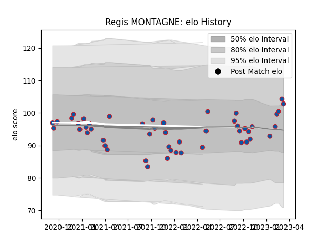

---  
layout: page  
title: Regis MONTAGNE  
date: 2023-02-04 18:32:34.646787  
categories: player  
---
# Regis MONTAGNE

## Positions: P

## Current elo: 100.0

## Current Percentile: 64.0

# Elo History

# Match History

| Team     |   Appearances |   Win Rate |
|:---------|--------------:|-----------:|
| Grenoble |            45 |   0.533333 |

| Opponent                   |   Matches |   Win Rate |
|:---------------------------|----------:|-----------:|
| Carcassonne                |         5 |   0.5      |
| Rouen                      |         5 |   0.6      |
| Oyonnax                    |         5 |   0.4      |
| Beziers                    |         4 |   0.5      |
| Agen                       |         3 |   1        |
| Aurillac                   |         3 |   0.333333 |
| Provence Rugby             |         3 |   0.333333 |
| US Bressane                |         2 |   0.5      |
| Soyaux-Angouleme           |         2 |   0.5      |
| Nevers                     |         2 |   1        |
| Montauban                  |         2 |   0.75     |
| Mont-de-Marsan             |         2 |   0.5      |
| Bayonne                    |         2 |   0.5      |
| Narbonne                   |         1 |   1        |
| Perpignan                  |         1 |   0        |
| Biarritz Olympique         |         1 |   0        |
| Valence Romans Drome Rugby |         1 |   1        |
| Vannes                     |         1 |   0        |